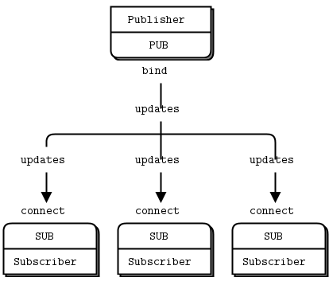

!SLIDE full-page home light-on-dark
# ØMQ #
### Twitter: @krzkot ###
### Github:  lis2 ###
### Email:   kotlarek.krzysztof@gmail.com ###
[background](/image/images/ruby.jpg)

!SLIDE full-page light-on-dark
# "Rails doesn't scale"
### OI
[background](/image/images/slow.jpg)

!SLIDE full-page light-on-dark
[background](/image/images/nodejs.jpg)

!SLIDE full-page light-on-dark
[background](/image/images/nodejs2.jpg)

!SLIDE full-page light-on-dark
[background](/image/images/clojure.png)

!SLIDE full-page light-on-dark
[background](/image/images/erlang.png)

!SLIDE full-page light-on-dark
# Downsides
* Painful hire
* Painful discussions with boss
* Painful discussions with clients
[background](/image/images/bad.jpg)

!SLIDE full-page home light-on-dark
# Service Oriented Architecture #
[background](/image/images/ruby.jpg)

!SLIDE full-page center

!SLIDE full-page center

!SLIDE full-page light-on-dark
# Upsides
* Small subset of tests
* Mini Application has narrow scope
* Connect different technologies
* Deploys are separated
* Easy to scale
[background](/image/images/happy.jpg)

!SLIDE full-page light-on-dark
# Downsides
* More code for commucation
* Deploys can be more difficult
* Harder to monitor
[background](/image/images/bad.jpg)

!SLIDE full-page light-on-dark
* Jobs
* Login page
* Tasks
* Analytics
* Client
* Employer
[background](/image/images/bridge.jpg)

!SLIDE full-page center

!SLIDE full-page center
# Distributed Computing Made Simple

!SLIDE center
# ZeroMQ
* The socket library that acts as a concurrency framework.
* Carries messages across inproc, IPC, TCP, and multicast.
* Connect N-to-N via fanout, pubsub, pipeline, request-reply.
* Asynch I/O for scalable multicore message-passing apps.
* 40+ languages including C, C++, Java, .NET, Python, Ruby, NodeJS

!SLIDE center
# Who is using?
* AT&T
* Cisco
* NASA
* Zynga
* Spotify
* Samsung Electronics
* CERN

!SLIDE full-page center light-on-dark
# Ø
* Zero latency
* Zero administration 
* Zero cost
* Zero waste
[background](/image/images/happy.jpg)

!SLIDE full-page center

!SLIDE full-page center
# Request-Reply

!SLIDE center
# Request
    @@@ ruby
    #!/usr/bin/env ruby
    
    require 'rubygems'
    require 'ffi-rzmq'
    
    context = ZMQ::Context.new
    
    puts "Connecting to hello world server..."
    requester = context.socket(ZMQ::REQ)
    requester.connect("tcp://localhost:5555")
    
    0.upto(9) do |request_nbr|
      puts "Sending request #{request_nbr}..."
      requester.send_string "Hello"
    
      reply = ''
      requester.recv_string(reply)
    
      puts "Received reply #{request_nbr}: [#{reply}]"
    end
    
!SLIDE center
# Response
    @@@ ruby
    #!/usr/bin/env ruby
    
    require 'rubygems'
    require 'ffi-rzmq'
    
    context = ZMQ::Context.new
    
    puts "Starting Hello World server..."
    
    socket = context.socket(ZMQ::REP)
    socket.bind("tcp://*:5555")
    
    while true do
      request = ''
      rc = socket.recv_string(request)
    
      puts "Received request. Data: #{request.inspect}"
    
      sleep 1
      socket.send_string("world")
    end

!SLIDE full-page light-on-dark
[background](/image/images/example.jpg)

!SLIDE full-page center
# Publisher-Subscriber

!SLIDE center
# Subscriber A
    @@@ ruby
    #!/usr/bin/env ruby
    
    require 'ffi-rzmq'
    
    context = ZMQ::Context.new
    subscriber = context.socket ZMQ::SUB
    subscriber.connect "tcp://localhost:5563"
    subscriber.setsockopt ZMQ::SUBSCRIBE, 'ALL'
    subscriber.setsockopt ZMQ::SUBSCRIBE, 'A'
    
    loop do
      # Two recv s because of the multi-part message.
      address = ''
      subscriber.recv_string address
    
      content = ''
      subscriber.recv_string content
    
      puts "[#{address}] #{content}"
    end
    
!SLIDE center
# Subscriber B
    @@@ ruby
    #!/usr/bin/env ruby
    
    require 'ffi-rzmq'
    
    context = ZMQ::Context.new
    subscriber = context.socket ZMQ::SUB
    subscriber.connect "tcp://localhost:5563"
    subscriber.setsockopt ZMQ::SUBSCRIBE, 'ALL'
    subscriber.setsockopt ZMQ::SUBSCRIBE, 'B'
    
    loop do
      # Two recv s because of the multi-part message.
      address = ''
      subscriber.recv_string address
    
      content = ''
      subscriber.recv_string content
    
      puts "[#{address}] #{content}"
    end

!SLIDE center
#  Publisher
    @@@ ruby
    #!/usr/bin/env ruby
    
    require 'ffi-rzmq'
    
    context = ZMQ::Context.new
    publisher = context.socket ZMQ::PUB
    publisher.bind "tcp://*:5563"
    
    loop do
      publisher.send_string 'A', ZMQ::SNDMORE
      publisher.send_string "Message for A"
    
      publisher.send_string 'B', ZMQ::SNDMORE
      publisher.send_string "Message for B"
    
      publisher.send_string 'ALL', ZMQ::SNDMORE
      publisher.send_string "Message for ALL"
    
      sleep 1
    end

!SLIDE full-page light-on-dark
[background](/image/images/example.jpg)

!SLIDE full-page center
# Parallel Pipeline 

!SLIDE full-page center
# Fair Queuing

!SLIDE full-page light-on-dark
# Performance
[background](/image/images/speed.jpg)

!SLIDE full-page
    @@@ ruby
    conn = Faraday.new 'http://localhost:4567'
    t=Time.now ; 3000.times { conn.get('/hi') } ; Time.now - t

!SLIDE full-page center

!SLIDE full-page center

!SLIDE full-page light-on-dark
# Resources
[background](/image/images/book.jpg)

!SLIDE full-page center

!SLIDE
* http://blog.arkency.com/2013/12/rails-and-soa-do-i-really-need-to-have-this-big-app/
* http://zguide.zeromq.org/page:all
* https://github.com/chuckremes/ffi-rzmq/tree/master/examples

!SLIDE full-page home light-on-dark
# Thank you
[background](/image/images/ruby.jpg)

