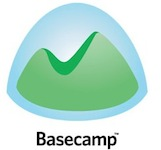
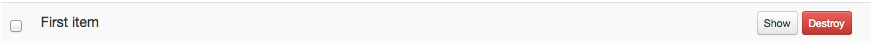
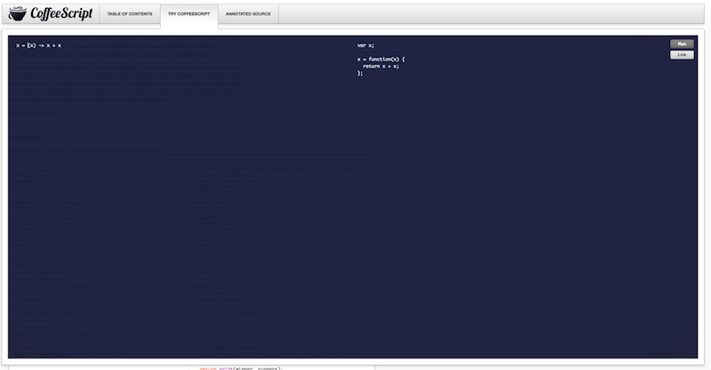

!SLIDE transition=scrollLeft first
# Single Page Application #
## Krzysztof Kotlarek ##
### Twitter: @krzkot ###
### Github:  lis2 ###
### Email:   kotlarek.krzysztof@gmail.com ###

!SLIDE transition=scrollLeft
# What is SPA?
* all necessary code is retrieved with a single page load
* more fluid user experience
* page does not automatically reload

!SLIDE transition=scrollLeft
# Characteristics
* All of the client logic in javascript
* Updates to many parts of the UI on changes to data
* Templating on the client side

!SLIDE transition=scrollLeft
# TODO App

!SLIDE transition=scrollLeft
#  Why ?

!SLIDE transition=scrollLeft
#  Who ?

!SLIDE transition=scrollLeft who

!SLIDE transition=scrollLeft
# Disadvantage
!SLIDE transition=scrollLeft
# We need to like javascript

!SLIDE transition=scrollLeft
# We need to love javascript

!SLIDE transition=scrollLeft
# Why I don't like javascript

!SLIDE transition=scrollLeft dont-like

* Lorem ipsum dolor sit amet, consectetur adipiscing elit. Morbi sagittis accumsan tincidunt. Vivamus elementum, lacus non molestie dignissim, libero lectus venenatis nunc, quis feugiat libero risus a sem. Aliquam erat volutpat. Integer risus ligula, venenatis a semper eget, dictum at ante. Donec dapibus lorem non mauris fringilla scelerisque. Nulla eu lacus ipsum. Vestibulum magna nunc, egestas non dapibus id, eleifend blandit risus. Nullam tempor, ligula sit amet volutpat pretium, enim est pellentesque lectus, sit amet lobortis tellus quam a arcu. Nulla dictum, sapien a sollicitudin congue, dolor lorem rutrum nisl, ut consectetur est justo id sapien. Praesent laoreet, purus lacinia dignissim interdum, urna mi pellentesque dolor, vitae auctor mauris mauris nec est. Pellentesque arcu purus, faucibus varius vulputate vestibulum, mollis fermentum diam. Quisque aliquet semper nisl, vel viverra felis pellentesque eget.

* Nulla sodales lectus ut lacus interdum a lacinia arcu rhoncus. Nam pellentesque arcu eget dui iaculis eget adipiscing justo porta. Ut non arcu dolor, id semper sapien. Morbi tincidunt arcu ut mi hendrerit dictum. Pellentesque id porta nulla. Suspendisse potenti. Aliquam eget sem leo, non cursus nisl. Proin feugiat pellentesque risus, sit amet placerat orci commodo in. Donec molestie diam ac ligula tempus convallis. Donec turpis neque, tristique et volutpat quis, ullamcorper eu eros.

* Etiam risus turpis, placerat malesuada aliquet ultrices, adipiscing ac lectus. Donec eu tellus quis lectus sodales venenatis. Integer rutrum egestas dui, eleifend vehicula ligula sodales vitae. Morbi consectetur fringilla tellus, quis rutrum erat dignissim sit amet. Nulla sollicitudin consequat eros, eu scelerisque metus faucibus sit amet. Sed tempor dolor eget est hendrerit sit amet venenatis nisi dignissim. Praesent lobortis, nunc at consectetur sodales, dolor urna fringilla ante, quis consectetur ipsum dolor non ipsum. Aenean venenatis, mi et blandit dignissim, elit velit molestie ligula, vel porttitor neque dolor eu mauris. Sed feugiat mauris ac est tincidunt vitae scelerisque ligula feugiat. Pellentesque venenatis, orci vel eleifend faucibus, dolor tortor tincidunt turpis, eget lacinia dolor felis in magna. Morbi sed risus magna, in feugiat justo. Proin condimentum, eros sit amet tristique tincidunt, turpis orci adipiscing nunc, ac dignissim velit justo eget eros.

* Donec et auctor odio. Morbi blandit, eros vitae rutrum rhoncus, dui ipsum sollicitudin est, at commodo est sem non odio. Fusce volutpat mi sit amet dui molestie at ultricies lectus mollis. Integer tincidunt congue est, at bibendum arcu tristique vel. Etiam ac urna urna, at dictum nibh. Suspendisse sapien purus, ullamcorper non scelerisque sagittis, molestie non nisl. Duis porttitor tempus laoreet. Phasellus sit amet arcu at felis bibendum facilisis. Vestibulum arcu nulla, auctor vitae viverra a, ornare eget tortor. Vestibulum bibendum massa et justo facilisis a rhoncus lorem adipiscing. Donec hendrerit imperdiet neque, id tempor sapien blandit ut. Nunc porttitor pretium tellus, et porttitor lacus ultrices ac.

* Sed interdum auctor lorem, id vehicula sapien faucibus sed. Nulla facilisi. Suspendisse sodales vehicula est, ac tincidunt felis interdum sed. Vestibulum id interdum sapien. Maecenas varius porta imperdiet. Proin a urna odio. Curabitur pretium nisl vel urna semper in viverra enim volutpat. 

* Lorem ipsum dolor sit amet, consectetur adipiscing elit. Sed ac urna erat. Nulla suscipit nulla vitae felis sagittis adipiscing. Ut a dui tortor, eget dignissim risus. Integer eu enim lorem, et tincidunt turpis. Donec eget est quam, id lacinia velit. Vivamus nec felis et augue vulputate ornare. Fusce vehicula suscipit enim sit amet tincidunt. Nunc ut nunc id neque mattis ultricies at lobortis nisi. Class aptent taciti sociosqu ad litora torquent per conubia nostra, per inceptos himenaeos. Etiam tempor ullamcorper quam vel suscipit. Curabitur iaculis venenatis sem, sit amet tincidunt turpis consectetur nec. Phasellus semper, felis sit amet tincidunt fermentum, lorem nibh mattis felis, et placerat orci urna eu enim. Sed ut vestibulum nulla. Ut in eros vitae augue pretium cursus sit amet cursus quam. Sed urna libero, ultrices et pellentesque a, dictum sit amet turpis. Mauris eu risus non mauris vehicula facilisis in vel ante.

* Vivamus vel ligula sed orci ornare porta in eu turpis. Nulla sit amet lobortis ligula. Mauris placerat imperdiet tincidunt. Sed vel diam diam, quis commodo quam. Pellentesque habitant morbi tristique senectus et netus et malesuada fames ac turpis egestas. Vestibulum ornare tempor mattis. Curabitur bibendum cursus augue nec mollis. Morbi auctor, lectus eget feugiat convallis, tellus ligula eleifend lacus, posuere tincidunt turpis mi eu tortor. Praesent tempus lobortis dui vitae volutpat. Fusce consequat ipsum non nunc eleifend nec ullamcorper libero venenatis. Pellentesque a sagittis mauris. Phasellus lorem leo, convallis vitae tincidunt sit amet, pharetra quis metus. Fusce porta orci non felis sodales tincidunt.

* Mauris ultrices lorem sit amet purus volutpat eu aliquet augue rutrum. Phasellus est diam, rhoncus et consequat varius, blandit dapibus massa. Quisque scelerisque semper interdum. Donec feugiat malesuada vestibulum. Sed a sem augue. Sed varius quam at lacus semper eget rhoncus sapien accumsan. Ut iaculis quam nec velit condimentum luctus. Sed quis dui neque. Curabitur ut turpis non urna accumsan ornare malesuada sit amet lectus. Suspendisse at arcu et augue aliquet venenatis.

* Proin sodales ullamcorper gravida. Aliquam erat volutpat. Nullam rutrum sollicitudin lacinia. Aliquam nunc massa, bibendum id elementum sit amet, auctor eu magna. Integer nulla eros, luctus quis scelerisque non, tempus et tellus. Sed libero magna, gravida et aliquet ut, tincidunt bibendum magna. Donec nunc magna, aliquam sit amet rhoncus id, venenatis nec tellus. Curabitur sit amet gravida quam. Suspendisse lacinia pellentesque ligula, a sollicitudin libero consectetur non. Maecenas sed velit elit, vel sagittis quam. Suspendisse sed justo velit, quis posuere lectus. Ut non mi vel erat sodales fringilla eget in sapien. Aenean lacus odio, facilisis eget ullamcorper quis, molestie et risus. Maecenas sodales nisi non ante iaculis id porttitor tortor commodo.

* Suspendisse sit amet enim vel orci suscipit hendrerit. Donec neque tellus, facilisis eu adipiscing vel, dapibus eu justo. Nam diam dolor, lacinia eget auctor euismod, sollicitudin at tortor. Nulla facilisi. Nulla euismod magna vitae purus facilisis in auctor erat gravida. Praesent vulputate est sed purus laoreet feugiat. In et nibh vel metus egestas euismod. Nunc et lacus non sem congue pulvinar nec id quam. Nunc placerat ullamcorper purus et fringilla.

* Sed ac est urna. Vestibulum lacinia, est a commodo scelerisque, ligula nulla dapibus augue, sit amet imperdiet arcu lacus nec tortor. Nulla gravida hendrerit luctus. In facilisis tellus ullamcorper dui elementum tristique. Suspendisse potenti. Phasellus adipiscing, magna a facilisis rutrum, dolor orci pulvinar eros, ut volutpat justo augue vitae lectus. Pellentesque nisl risus, vehicula nec sodales et, tincidunt quis sem.

* Pellentesque vitae lacus eget dolor condimentum scelerisque eget et neque. Ut molestie dolor quis felis suscipit nec malesuada arcu fringilla. Nam id massa eu nisl cursus viverra. In mattis ultricies sem, sed facilisis sapien tincidunt viverra. Phasellus vitae lectus lectus, et semper massa. Suspendisse potenti. Vivamus et velit porttitor nulla aliquam ultrices semper a libero. Phasellus ultrices, metus quis pulvinar tempus, sem libero ullamcorper quam, eget pellentesque tortor nibh at ipsum. Proin hendrerit placerat erat, et tincidunt purus rutrum at. Fusce interdum egestas tincidunt.

* Etiam et ligula eu nisl placerat iaculis. Integer porta aliquam adipiscing. Donec at erat magna. Aliquam sed eros urna, ut pellentesque ipsum. Praesent pellentesque est eget dolor accumsan cursus. Fusce pretium auctor felis, at tincidunt leo malesuada sed. Vivamus in arcu eget nibh placerat ultrices.

* In et neque nec erat mattis eleifend. Nunc in risus at nibh commodo posuere. Nullam mollis, ligula bibendum feugiat vestibulum, mi risus molestie eros, sit amet dignissim magna tellus eget orci. Maecenas non sapien sapien. Integer quis rhoncus nibh. Vivamus sed dolor velit. Donec hendrerit pellentesque nulla eu pretium. Sed feugiat lobortis porttitor. Quisque mattis ultrices sem, ut facilisis nisi semper vel. Vivamus iaculis tempus ipsum. Curabitur turpis turpis, rhoncus quis iaculis ac, tincidunt at ipsum. Nullam mauris arcu, vulputate sed tincidunt a, pellentesque sed velit.

* Proin urna quam, molestie sed faucibus at, pellentesque quis dui. Vestibulum pretium, enim eget aliquet convallis, dolor felis cursus ipsum, nec dapibus metus est facilisis sem. Nulla a hendrerit elit. Aliquam erat volutpat. Sed ut blandit nulla. Integer in nisl quam. Pellentesque rutrum tempus libero eget bibendum. Phasellus mattis nisl non elit venenatis suscipit. Vivamus vehicula velit nec libero fringilla nec pretium erat commodo. Praesent laoreet consectetur lorem quis mattis. Morbi metus enim, pharetra ac ultricies vel, gravida a sapien. 

* Lorem ipsum dolor sit amet, consectetur adipiscing elit. Sed eleifend nunc in felis consectetur euismod. Suspendisse sodales ultrices ante, at venenatis erat laoreet sed. Pellentesque quam enim, iaculis at porttitor a, tristique vitae nunc. Vestibulum eget elit sed elit fermentum faucibus. Nam nec nibh orci, mollis suscipit metus. Morbi eget ipsum nec quam porta sollicitudin sit amet in mauris. Pellentesque non lacus a nisl bibendum sollicitudin id nec magna. Praesent tincidunt molestie facilisis.

* Nulla lacinia velit diam. Aenean aliquet accumsan sodales. Fusce nunc nisl, semper ac bibendum vel, sollicitudin eu lacus. Proin consectetur nulla id sapien eleifend convallis. Ut gravida erat id nisl scelerisque aliquam. Pellentesque convallis vulputate nisi et lobortis. Aenean quis dui purus. Nulla facilisi. Proin semper nulla ut est tristique ullamcorper. Phasellus ut mi odio, nec mollis nisl. Aenean ultricies faucibus dui, ac venenatis dui eleifend eu. Morbi blandit malesuada semper. Curabitur sed feugiat lorem. Curabitur tristique tortor arcu, ac lacinia lorem.

* Donec auctor nisi lectus, nec consectetur justo. Etiam vehicula magna ut tellus ornare in sodales tellus aliquam. Vestibulum mattis nulla sed urna porttitor molestie. Curabitur vulputate, libero eu mollis tristique, lorem ante cursus neque, ut varius velit turpis sit amet elit. Phasellus vulputate nunc nec lorem placerat eget volutpat massa interdum. Quisque magna eros, feugiat nec suscipit a, lobortis ac leo. Duis ullamcorper libero sed ipsum lacinia vitae feugiat ipsum laoreet. Vivamus sed orci ligula, vitae rutrum nibh. Cum sociis natoque penatibus et magnis dis parturient montes, nascetur ridiculus mus. Duis tincidunt ultrices tortor, non facilisis est imperdiet a. Mauris at eros at augue mollis placerat. Nunc in tristique odio. Pellentesque non neque enim. Morbi sodales euismod sem ac placerat.

* Quisque ac tortor at metus viverra sollicitudin. Nullam id tortor eget neque lacinia malesuada. Nulla eget massa dui, a adipiscing odio. Vestibulum ac sapien at nulla lacinia posuere. Fusce venenatis diam id metus iaculis lacinia. Suspendisse id lacus id orci mattis sodales. Phasellus condimentum tortor at ipsum varius et consequat arcu dignissim. Fusce commodo lorem in mi accumsan laoreet. Duis nec volutpat enim. Curabitur diam sapien, tempor non varius vel, ultricies ac dolor. Vivamus dignissim ullamcorper nibh vel semper. Duis in dolor ut ante gravida vulputate vel ut turpis. Nulla facilisi. Phasellus vestibulum velit nec quam pulvinar tincidunt. Proin id sem in libero porttitor venenatis vitae et justo.

* Pellentesque nec nibh sed leo pretium posuere. Integer sed quam leo. Duis sollicitudin urna a nulla rutrum tempus. Nullam augue sapien, imperdiet quis elementum eu, tempus ut sem. Nulla porta quam at urna pretium eu eleifend nunc hendrerit. Duis non lectus id libero blandit scelerisque. Fusce pulvinar, quam et eleifend facilisis, nisl enim hendrerit diam, nec consectetur erat ipsum vel mi. Cum sociis natoque penatibus et magnis dis parturient montes, nascetur ridiculus mus. Proin ligula mauris, imperdiet non rhoncus id, aliquet nec mi. In vulputate adipiscing est, in consequat tortor viverra congue. Aliquam pulvinar mi eget risus eleifend consectetur. Sed posuere est ac libero tristique at tempus dui feugiat. In hac habitasse platea dictumst. Suspendisse cursus sem vitae risus posuere vehicula.

* Curabitur elit mauris, fringilla at semper a, tempus ut dui. Sed ipsum purus, semper ac hendrerit eu, euismod quis neque. Phasellus non tellus odio, vitae vehicula nisl. Nulla luctus tincidunt nisl, non laoreet lectus fringilla vel. Etiam nisl velit, convallis ut feugiat ut, molestie vitae neque. Etiam iaculis ornare est, tempor tempus lectus semper eu. Ut pharetra placerat elit eu ullamcorper. Sed tempor feugiat mattis. In suscipit, nibh sit amet ullamcorper euismod, augue nisi tristique nibh, cursus facilisis mauris felis sit amet lacus. Integer ultrices, lorem sit amet rhoncus tincidunt, velit metus dictum arcu, non iaculis nulla nisl at massa. Nunc ullamcorper feugiat porta. Morbi porttitor tincidunt libero, vel volutpat ipsum blandit molestie. Etiam placerat erat sed nulla volutpat tristique.

* Duis sollicitudin porta ligula, a varius massa lacinia vitae. Vestibulum odio purus, iaculis eget sagittis ut, ornare at nisi. Nulla tristique malesuada turpis, vel commodo elit pulvinar a. Sed sollicitudin pulvinar turpis, non rhoncus nunc rutrum ut. Nulla facilisi. Quisque fringilla faucibus consectetur. Aliquam id risus sit amet leo lacinia aliquam eget sed nisl. Aenean a dui neque. Donec consectetur dui eu sapien lobortis a lobortis lectus volutpat. Vestibulum ante ipsum primis in faucibus orci luctus et ultrices posuere cubilia Curae; Proin arcu dui, adipiscing et gravida sed, dapibus eget leo. Sed non nunc nec magna aliquam gravida.

* Integer venenatis neque ac tellus porta mollis rhoncus turpis vehicula. Sed mollis nibh facilisis purus iaculis fermentum. Nunc mauris leo, ultricies sed venenatis ac, vulputate non justo. Pellentesque habitant morbi tristique senectus et netus et malesuada fames ac turpis egestas. Duis vulputate congue odio, quis gravida turpis aliquet vitae. Phasellus nunc tortor, interdum id mattis dictum, gravida nec elit. Nulla facilisi. Nulla facilisi. Donec in erat pellentesque leo vehicula elementum a ut dui.

* In ac augue odio, sed auctor orci. Sed quis luctus dui. Curabitur laoreet malesuada dolor. Sed sed eros libero, in lobortis mauris. Nulla dignissim, orci vitae gravida pulvinar, est felis accumsan ipsum, eu posuere nibh mi in arcu. Vivamus metus felis, convallis ac pharetra a, fringilla vulputate neque. Curabitur iaculis leo velit. Nulla sit amet lacus nec mi rutrum luctus. Sed lobortis lorem in dui luctus et fermentum purus hendrerit. Morbi ac arcu non erat aliquet laoreet egestas vitae orci. Cras feugiat hendrerit arcu, quis facilisis nulla molestie ac. Nullam sed faucibus magna.

* Maecenas fringilla ornare ligula, quis fringilla felis tempor ac. Aenean quis nunc scelerisque lorem viverra sodales. Vestibulum augue magna, blandit eu cursus non, tempus quis urna. In hac habitasse platea dictumst. Nunc tincidunt mi ut lectus gravida mollis. Pellentesque tempus varius augue sed sagittis. Nunc vel augue vel risus vestibulum accumsan dapibus et eros. Nulla tincidunt tempus dolor, eget facilisis mi vestibulum sed. Donec sit amet semper nisi. Aenean laoreet auctor egestas. 

* Lorem ipsum dolor sit amet, consectetur adipiscing elit. Mauris faucibus placerat erat ac rhoncus. Cum sociis natoque penatibus et magnis dis parturient montes, nascetur ridiculus mus. Morbi ante ante, viverra vitae auctor eu, vehicula ut urna. Phasellus vitae tortor quis ligula placerat blandit. Morbi sit amet velit et enim feugiat faucibus nec nec enim. Pellentesque felis libero, venenatis ac ultricies ut, tincidunt at nisl. Aenean leo urna, venenatis id tincidunt nec, eleifend sed diam. Aenean eu urna lacus. Nullam fermentum porttitor sodales.

* Suspendisse elementum, felis interdum dictum iaculis, augue eros feugiat odio, volutpat facilisis metus enim eu tortor. Integer porttitor tristique tincidunt. Maecenas mattis tellus quis risus bibendum blandit. Vivamus egestas sodales mi ut accumsan. Proin luctus, diam at porttitor consectetur, augue tellus malesuada augue, et sagittis nibh massa vitae leo. Maecenas lacinia, metus eget feugiat feugiat, metus augue congue sapien, et congue arcu mi a ligula. In aliquet iaculis viverra. Ut non diam at ante convallis gravida. Nunc congue mattis lorem, at malesuada augue elementum eget. Aliquam commodo dictum dolor eget malesuada. Praesent vel lacus tellus. In hac habitasse platea dictumst. Duis congue augue id nulla sollicitudin commodo. Lorem ipsum dolor sit amet, consectetur adipiscing elit. Cras scelerisque metus sit amet mauris tristique tempor. In eget turpis nulla, ut accumsan magna.

* Quisque congue ipsum nisl. Etiam dignissim velit a orci tristique tincidunt. Vivamus sed dui id erat euismod porta at lobortis libero. Duis eget elementum erat. Phasellus pretium posuere justo, a euismod urna accumsan et. Vestibulum et enim nec felis eleifend tincidunt. In dapibus sodales sapien eget mollis. Aliquam nec mi vitae metus varius venenatis non ac urna. Fusce et lorem in libero egestas cursus. Quisque porttitor neque in orci dapibus nec lacinia ipsum hendrerit. Integer laoreet varius eros, at blandit nisi convallis ac. Integer hendrerit elementum ipsum at hendrerit. Nunc bibendum dictum diam, in convallis diam accumsan eu. Sed dapibus semper tincidunt.

* Integer eu suscipit metus. Phasellus aliquet purus et felis cursus adipiscing. Nulla scelerisque adipiscing gravida. Suspendisse sit amet metus non massa luctus congue. Sed diam ligula, suscipit vitae tincidunt at, consectetur nec nibh. Cras condimentum nulla et tortor fringilla consequat. Vestibulum in nibh lacus. Fusce ac ante sit amet enim placerat ultricies. Morbi molestie felis sed libero fermentum vel scelerisque urna tempus. Vestibulum in tellus ligula. Donec sit amet leo eu nisl pharetra mattis. Donec felis lectus, vehicula eu cursus quis, feugiat in arcu. Integer non libero ante. Mauris sollicitudin nisl sed ipsum fringilla cursus.

* Nullam cursus, dui a condimentum tincidunt, quam velit rhoncus lectus, at pellentesque diam ipsum a dui. Praesent pulvinar nisl in massa molestie vel volutpat massa consectetur. Aliquam bibendum cursus quam, in sodales diam tincidunt eget. Nullam congue, ante a dictum volutpat, mauris turpis porta dolor, sed molestie tellus justo quis dui. Duis eget lacus mauris, sollicitudin aliquet quam. Vivamus vel augue a nulla bibendum mattis. Sed lacinia augue sed tortor porttitor aliquam. Sed dictum eros at lectus malesuada consectetur. Nam non sem neque. Aliquam erat volutpat. Quisque sit amet purus eget mi luctus laoreet. Etiam lacinia mauris sed lectus tempus egestas. Pellentesque volutpat erat id nunc lacinia luctus. Nunc ut erat nec nisi cursus elementum. Duis dapibus, libero sed accumsan blandit, turpis massa tempus urna, sed tristique felis lorem id ipsum. Sed vitae nunc hendrerit lectus condimentum cursus.

* Morbi varius posuere magna nec dictum. Vivamus viverra nisl eu nulla gravida imperdiet. Lorem ipsum dolor sit amet, consectetur adipiscing elit. Etiam cursus diam sed justo accumsan elementum. Suspendisse eget tincidunt mi. Vestibulum fermentum velit in quam rhoncus auctor. Aenean lacinia lacus sit amet risus vulputate ullamcorper. Nam vitae molestie libero. Pellentesque habitant morbi tristique senectus et netus et malesuada fames ac turpis egestas. Duis a tellus at sem scelerisque pharetra. Aenean vehicula volutpat turpis sit amet porttitor. Nulla hendrerit dolor vel neque placerat eget lobortis tellus lobortis. Suspendisse porttitor, dolor nec tempus posuere, arcu velit aliquam augue, a bibendum libero risus sit amet turpis.

* Phasellus mollis faucibus risus ac venenatis. Cras ligula neque, volutpat a lacinia id, egestas eget nulla. Vivamus euismod semper est ac laoreet. Duis vel porttitor metus. Cras porttitor orci leo, eu tincidunt leo. Donec ac lectus ligula, non bibendum arcu. Pellentesque habitant morbi tristique senectus et netus et malesuada fames ac turpis egestas. Vivamus ornare, tortor sit amet scelerisque tristique, tellus lectus ultricies nulla, id commodo diam nibh aliquam est. Nam arcu magna, sodales convallis ultrices at, tristique at velit.

* Phasellus nec odio non urna condimentum tempus. Aliquam auctor scelerisque placerat. Aliquam erat volutpat. Vivamus nunc massa, fringilla a consequat ac, aliquet sit amet lectus. Aliquam erat volutpat. Quisque mollis suscipit tellus sit amet scelerisque. Etiam non sem ut dui rhoncus pharetra non ut mi. Curabitur tristique, purus interdum aliquet convallis, nisi leo sollicitudin justo, vel aliquet tellus lorem nec neque. Ut eu tellus tortor, nec blandit tellus. Quisque vulputate odio et nisi dignissim blandit. Nulla facilisi.

* Pellentesque venenatis neque in augue commodo ut blandit lectus ullamcorper. Duis at nunc eget nisi adipiscing porta. Etiam tristique sagittis massa eu tincidunt. Suspendisse potenti. Sed vel neque nunc, vel posuere mauris. In nec velit felis, sit amet faucibus libero. Duis magna erat, accumsan ut egestas id, congue sit amet nunc. Etiam pharetra ligula tincidunt urna rutrum tincidunt. Quisque congue interdum lacinia. Sed eu pulvinar mi. Mauris aliquam sagittis nunc, in sodales ligula aliquet sed. Suspendisse blandit pretium dolor, vel commodo enim pharetra nec. Duis ac sem eu tortor auctor tincidunt. Integer arcu dui, fringilla non varius in, varius ut mi. Aenean luctus tempor ante eget vulputate. Vivamus egestas felis et odio consectetur condimentum vulputate in erat.

!SLIDE transition=scrollLeft
    @@@javascript

    $("#slider-appointment-series").slider({
      value: 1,
      min: 1,
      max: 25,
      slide: function( event, ui ) {
        $("#series").val( ui.value );
        if (ui.value == 1) {
          $("#series-view").html(ui.value + ' Termin');
        } else {
          $("#series-view").html(ui.value + ' Termine');
        }
      },
      change: function(event, ui) {
        Tutoria.Appointments.Create.ajaxUpdateAppointments(ui.value);
      }
    });

!SLIDE transition=scrollLeft
#http://wtfjs.com/

!SLIDE transition=scrollLeft
    @@@javascript

    0 === -0        //true
    1/0 === 1/-0    //false

!SLIDE transition=scrollLeft
    @@@ javascript

    d = new Date("couldn't you please throw an exception here instead?");
    d.getTime(); // => NaN

!SLIDE transition=scrollLeft

    @@@ javascript

    function Dude(name){
      this.name = name;
      return [1, 2, 3];
    }
    new Dude('Bob');
    // [1, 2, 3]

!SLIDE transition=scrollLeft
    @@@javascript

    function Dude(name){
      this.name = name;
      return 3;
    }
    new Dude('Bob');
    // { name: 'Bob' }

!SLIDE transition=scrollLeft
# Start doing it right now

!SLIDE transition=scrollLeft
# Ask for help

!SLIDE transition=scrollLeft

!SLIDE transition=scrollLeft
#CoffeeScript is a little language that compiles into JavaScript

!SLIDE transition=scrollLeft
#home.js.coffee

!SLIDE transition=scrollLeft
# Assignment
    @@@javascript

    var number = 42;

Coffeescript
    @@@javascript

    number = 42

!SLIDE transition=scrollLeft
# @
    @@@javascript

    this.value;

Coffeescript
    @@@javascript

    @value

!SLIDE transition=scrollLeft
# Conditions
    @@@javascript

    if (opposite) {
      number = -42;
    }
Coffeescript
    @@@javascript

    number = -42 if opposite
or
    @@@javascript

    if opposite
      number = -42

!SLIDE transition=scrollLeft
# Existence
    @@@javascript

    if (typeof elvis !== "undefined" && elvis !== null) {
      alert("I knew it!");
    }
Coffeescript
    @@@javascript

    alert "I knew it!" if elvis?

!SLIDE transition=scrollLeft
# Functions
    @@@javascript

    square = function(x) {
      return x * x;
    };

Coffeescript
    @@@javascript

    square = (x) -> x * x

!SLIDE transition=scrollLeft
    @@@javascript

    kids = {
      brother: {
        name: "Max",
        age: 11
      },
      sister: {
        name: "Ida",
        age: 9
      }
    };

Coffeescript
    @@@javascript

    kids =
      brother:
        name: "Max"
        age:  11
      sister:
        name: "Ida"
        age:  9

!SLIDE transition=scrollLeft
    @@@javascript

    var i = 0;
    var food;
    var ref = ['toast', 'cheese', 'wine'];
    for (i = 0, len = ref.length; i < len; i++) {
      food = ref[i];
      eat(food);
    }

Coffeescript
    @@@javascript

    eat food for food in ['toast', 'cheese', 'wine']

!SLIDE transition=scrollLeft
    @@@javascript

    var numbers, _ref;
    numbers = [0, 1, 2, 3, 4, 5, 6, 7, 8, 9];
    [].splice.apply(numbers, [3, 4].concat(_ref = [-3, -4, -5, -6])), _ref;
Coffeescript
    @@@javascript

    numbers = [0, 1, 2, 3, 4, 5, 6, 7, 8, 9]
    numbers[3..6] = [-3, -4, -5, -6]

!SLIDE transition=scrollLeft
    @@@javascript

    var Animal = (function() {
      function Animal(name) {
        this.name = name;
      }

      Animal.prototype.move = function(meters) {
        return alert(this.name + (" moved " + meters + "m."));
      };

      return Animal;
    })();
Coffeescript
    @@@javascript

    class Animal
      constructor: (@name) ->

      move: (meters) ->
        alert @name + " moved #{meters}m."

!SLIDE transition=scrollLeft
    @@@javascript

    $("#slider-appointment-series").slider({
      value: 1,
      min: 1,
      max: 25,
      slide: function( event, ui ) {
        $("#series").val( ui.value );
        if (ui.value == 1) {
          $("#series-view").html(ui.value + ' Termin');
        } else {
          $("#series-view").html(ui.value + ' Termine');
        }
      },
      change: function(event, ui) {
        Tutoria.Appointments.Create.ajaxUpdateAppointments(ui.value);
      }
    });

!SLIDE transition=scrollLeft
    @@@javascript

    $("#slider-appointment-series").slider 
      value: 1
      min: 1
      max: 25
      slide: (event, ui) ->
        if ui.value == 1
          $("#series-view").html(ui.value + ' Termin')
        else
          $("#series-view").html(ui.value + ' Termine')
      change: (event, ui) ->
        Tutoria.Appointments.Create.ajaxUpdateAppointments(ui.value)

!SLIDE transition=scrollLeft
    @@@javascript

    updateSelectDay: function(month, year) {

      var select = $("#lesson_scheduled_for_3i")[0];
      while(select.options.length > 0) {
        select.options[0] = null;
      }

      var days = Tutoria.Appointments.Create.daysInMonth(month, year);
      for(var i = 0; i < days; i++) {
        select.options[i] = new Option(i+1, i+1);
      }
    }

!SLIDE transition=scrollLeft
    @@@javascript

    updateSelectDay: (month, year) ->
      select = $("#lesson_scheduled_for_3i")[0]
      select.options[0] = null while select.options.length > 0

      days = Tutoria.Appointments.Create.daysInMonth(month, year)
      select.options[i] = new Option(i+1, i+1) for i in [0..days]

!SLIDE transition=scrollLeft
# underscore.js

!SLIDE transition=scrollLeft
# 80 functions
* each
* map
* find
* min/max
* sortBy

!SLIDE transition=scrollLeft
# 80 functions
* first/last
* indexOf
* uniq
* shuffle
* size

!SLIDE transition=scrollLeft
# Usage
    @@@javascript

    _.find [1..6], (num) -> num % 2 is 0 // 2
    _.min [10, 5, 100, 2, 1000] // 2
    _.shuffle [1..6] // 1,2,3,6,5,4
    _.last [5, 4, 3, 2, 1] // 1

!SLIDE transition=scrollLeft
# backbone.js

!SLIDE transition=scrollLeft
* 5.6kb packaged and gzipped
* only dependency underscore.js (4kb)
* need jQuery or Zepto for AJAX

!SLIDE transition=scrollLeft
#MVC
* models
* views
* collections

!SLIDE transition=scrollLeft
#Models
* data are represented as models
* can be created, validated, updated, destroyed on server
* attribute changes trigger 'change' event

!SLIDE transition=scrollLeft
#Collections
* collections of models
* Triggers events like add/remove
* can fetch data from url

!SLIDE transition=scrollLeft
#Collections
* can have url
* create -> POST /collections
* read   -> GET /collections/id
* update -> PUT /collections/id
* delete -> DELETE /collections/id

!SLIDE transition=scrollLeft
#Views
* More like RoR controllers
* responsible for instanting collections and binding events

!SLIDE transition=scrollLeft
# TODO App

!SLIDE transition=scrollLeft
#models/entry.rb
    @@@ruby

    class Entry < ActiveRecord::Base
      attr_accessible :name
      validates_presence_of :name
    end

!SLIDE transition=scrollLeft
#c/entries_controller.rb
    @@@ruby

    class EntriesController < ApplicationController
      before_filter :load_entry, only: %w(show update destroy)
      respond_to :json

      def index
        @entries = Entry.all
        respond_with @entries
      end

      def show
        respond_with @entry
      end

      def update
        @entry.status = params[:status]
        @entry.save
        respond_with @entry
      end

!SLIDE transition=scrollLeft
#c/entries_controller.rb
    @@@ruby

      def create
        @entry = Entry.new(name: params[:name])
        @entry.save
        respond_with @entry
      end

      def destroy
        @entry.destroy
        respond_with @entry
      end

      private
      def load_entry
        @entry = Entry.find params[:id]
      end
    end

!SLIDE transition=scrollLeft
#home/index.rhtml
    @@@html

    <h1>ToDo List!</h1>

    

    <table id="entries" class="table table-striped"></table>

!SLIDE transition=scrollLeft
    @@@ruby

    assets/
      javascripts/
        collections/
          entries.js.coffee
        models/
          entry.js.coffee
        routes
          entries_routes.js.coffee
        views/
          entries/
            entries_index.js.coffee
            entry.js.coffee
            form.js.coffee
      templates/
        entries/
          entry.jst.eco
          form.jst.eco

!SLIDE transition=scrollLeft
#form.jst.eco
    @@@html
    
    <form id="new_entry">
      <input type="text" name="name" id="new_entry_name" />
      <input type="submit" value="Add" class="btn btn-primary" />
    </form>

!SLIDE transition=scrollLeft
#entry.jst.eco
    @@@html
    
    <td>
      <input type="checkbox"
      <% if @entry.get('status') == "complete": %>
        checked=checked
      <% end %>/>
    </td>
    <td class="<%= @entry.get('status') %>"><%= @entry.get('name') %></td>
    <td>
      <a href="/#entries/<%= @entry.get('id') %>" class="btn btn-mini">Show</a>
      <a href="/#entries/<%= @entry.get('id') %>" class="btn btn-mini btn-danger delete">Destroy</a>
    </td>

!SLIDE transition=scrollLeft
#m/entry.js.coffee
    @@@javascript

    class ToDo.Models.Entry extends Backbone.Model
      toggleStatus: () ->
        if @get('status') == 'incomplete'
          @set({'status': 'complete'})
        else
          @set({'status': 'incomplete'})
        @save()

!SLIDE transition=scrollLeft
#c/entries.js.coffee
    @@@javascript

    class ToDo.Collections.Entries extends Backbone.Collection

      model: ToDo.Models.Entry
      url: '/entries'

      initialize: () ->
        @on('remove', @hideModel, this)

      hideModel: (model) ->
        model.trigger('hide')

      show: (id) ->
        modelsToRemove = @filter( (entry) ->
          return entry.id.toString() != id
        );
        @remove(modelsToRemove)

!SLIDE transition=scrollLeft
#entries_routes.js.coffee
    @@@ruby

    class ToDo.Routers.Entries extends Backbone.Router
      routes:
        '': 'index'
        'entries/:id': 'show'

      index: ->
        $("#entries").html("")
        @collection = new ToDo.Collections.Entries()
        @collection.fetch()

        index_view = new ToDo.Views.EntriesIndex(collection: @collection)
        form_view = new ToDo.Views.Form(collection: @collection)
        $('#form').html(form_view.render().el)

     show: (id) ->
       @collection.show(id)

!SLIDE transition=scrollLeft
#v/form.js.coffee
    @@@ruby

    class ToDo.Views.Form extends Backbone.View
    
      template: JST['entries/form']
    
      tagName: 'div'
    
      events:
        'submit #new_entry': 'createEntry'
    
      render: ->
        $(@el).html(@template())
        this
    
!SLIDE transition=scrollLeft
#v/form.js.coffee
    @@@ruby

    createEntry: (event) ->
      event.preventDefault()
      attributes = name: $('#new_entry_name').val()
      @collection.create attributes,
        wait: true
        success: ->
          $('#new_entry_name').val("")
          $('#new_entry_name').removeClass("error")
        error: (entry, response) ->
          if response.status == 0
            alert("Connection with server is broken, please try again later") 
          $('#new_entry_name').addClass("error")

!SLIDE transition=scrollLeft
#v/entry.js.coffee
    @@@ruby

    class ToDo.Views.Entry extends Backbone.View
    
      template: JST['entries/entry']
      tagName: "tr"
    
      events:
        'change input': 'toggleStatus'
        'click a.delete': 'onDestroy'
    
      initialize: () ->
        @model.on('change', @render, this)
        @model.on('destroy hide', @remove, this)
    
      remove: () ->
        $(@el).fadeOut()
    
      render: ->
        $(@el).html(@template(entry: @model))
        this

!SLIDE transition=scrollLeft
#v/entry.js.coffee
    @@@ruby   

      toggleStatus: () ->
        @model.toggleStatus()
    
      onDestroy: (event) ->
        event.preventDefault()
        @model.destroy()

!SLIDE transition=scrollLeft
#v/entries_index.js.coffee
    @@@ruby

    class ToDo.Views.EntriesIndex extends Backbone.View

      initialize: ->
        @collection.on('reset', @render, this)
        @collection.on('add', @appendEntry, this)

      render: ->
        @collection.each(@appendEntry)

      appendEntry: (entry) ->
        view = new ToDo.Views.Entry(model: entry)
        $('#entries').append(view.render().el)

!SLIDE transition=scrollLeft
# Pros
* Faster UI
* Can be made offline
* Perfect for HTML 5 mobile apps
* Works with Resful Web Services

!SLIDE transition=scrollLeft
# Cons
* Bad SEO

!SLIDE transition=scrollLeft
# Useful link

<a href="http://backbonejs.org/">http://backbonejs.org/</a>

<a href="http://coffeescript.org/">http://coffeescript.org/</a>

<a href="http://underscorejs.org/">http://underscorejs.org/</a>

<a href="http://www.youtube.com/watch?v=OmJNmLcVvQ4&list=UU8dsjHz_0WVzHjAANKiAqGw&index=24&feature=plcp">Elliott Kember - Rails and Friends (Railsberry 2012)</a>

<a href="http://www.youtube.com/watch?v=7-Y3wP9lLg0&list=UU8dsjHz_0WVzHjAANKiAqGw&index=26&feature=plcp">Sebastian Deutsch - All about CoffeeScript (Railsberry 2012)</a>

<a href="http://railscasts.com/episodes/323-backbone-on-rails-part-1">Railscast backbone.js part I</a>

<a href="http://railscasts.com/episodes/325-backbone-on-rails-part-2">Railscast backbone.js part II</a>

<a href="http://wtfjs.com//">http://wtfjs.com/</a>

<a href="https://github.com/addyosmani/backbone-fundamentals">Backbone fundamentals</a>

!SLIDE transition=scrollLeft
# coffeescript.org

!SLIDE transition=scrollLeft
# Fork 
[https://github.com/lis2/SPA-ToDo](https://github.com/lis2/SPA-ToDo)

!SLIDE transition=scrollLeft
# Questions?

