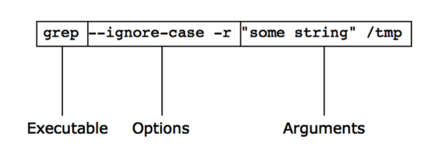
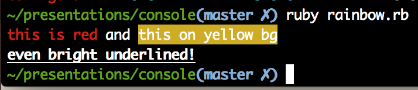
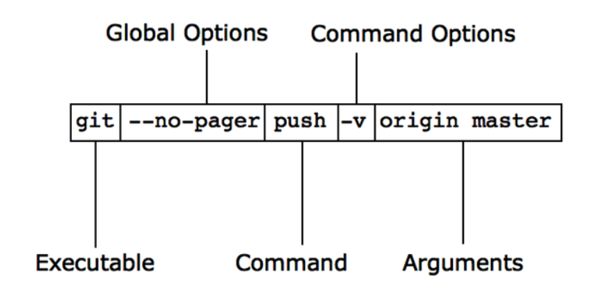

!SLIDE full-page home light-on-dark
# Command Line Applications in Ruby #
### Twitter: @krzkot ###
### Github:  lis2 ###
### Email:   kotlarek.krzysztof@gmail.com ###
[background](/image/images/ruby.jpg)

!SLIDE full-page light-on-dark center
# What is a good application?
* Have a clear an concise purpose
* Easy to use
* Helpful
* Plays well with others
* Has sensible defaults but is configurable
* Installs painlessly
[background](/image/images/min.png)

!SLIDE full-page center
# Command line app

!SLIDE full-page center
    @@@ sh
    ~ cowsay "JNS Meetup"
     ____________
    < JNS Meetup >
     ------------
            \   ^__^
             \  (oo)\_______
                (__)\       )\/\
                    ||----w |
                    ||     ||

!SLIDE full-page center
    @@@ sh
    ~ cowsay -e '--' "JNS Meetup"
     ____________
    < JNS Meetup >
     ------------
            \   ^__^
             \  (--)\_______
                (__)\       )\/\
                    ||----w |
                    ||     ||
!SLIDE full-page center
# Cowsay
    @@@ sh
    ~ cowsay --help
    /usr/local/bin/cowsay version [unknown] calling Getopt::Std::getopts 
    running under Perl version 5.18.2.
    
    Usage: cowsay [-OPTIONS [-MORE_OPTIONS]] [--] [PROGRAM_ARG1 ...]
    
    The following single-character options are accepted:
            With arguments: -e -f -T -W
            Boolean (without arguments): -b -d -g -h -l -L -n -N -p -s -t -w -y
    
    Options may be merged together.  -- stops processing of options.

!SLIDE full-page light-on-dark center
# JnsSay
[background](/image/images/min.png)

!SLIDE full-page light-on-dark center
# OptionParser
[background](/image/images/min.png)

!SLIDE full-page center
    @@@ ruby
    require 'optparse'
    
    options = {}
    OptionParser.new do |opts|
      opts.on("-u", "--user [USER]") do |u|
        options[:user] = u
      end
    
      opts.on("-m", "--message [MESSAGE]") do |m|
        options[:message] = m
      end
    end.parse!
    JnsSay::Say.new(options[:user], options[:message]).display

!SLIDE full-page light-on-dark center
# Help
[background](/image/images/min.png)

!SLIDE full-page center
    @@@ ruby
    require 'optparse'
    
    options = {}
    OptionParser.new do |opts|
      opts.banner = "Usage: jns_say.rb -u lis2 -m blablabla"
    
      opts.on("-u", "--user [USER]", "User name - top part of your output") do |u|
        options[:user] = u
      end
    
      opts.on("-m", "--message [MESSAGE]", "Message - bottom part of your output") do |m|
        options[:message] = m
      end
    end.parse!
    JnsSay::Say.new(options[:user], options[:message]).display

!SLIDE full-page center
    @@@ sh
    ~ lib/jns_say.rb -h
    Usage: jns_say.rb -u lis2 -m blablabla
        -u, --user [USER]                User name - top part of your output
        -m, --message [MESSAGE]          Message - bottom part of your output

!SLIDE full-page light-on-dark center
# gem-man
### The gem man command can be used to display a man page for an installed RubyGem. The man page must be included with the gem
[background](/image/images/min.png)

!SLIDE full-page light-on-dark center
# Default Behaviour
[background](/image/images/min.png)

!SLIDE full-page light-on-dark center
    @@@ ruby
    options = {
      user: "Anonymous"
    }
    OptionParser.new do |opts|
    ...
    end

!SLIDE full-page light-on-dark center
# Configuration
[background](/image/images/min.png)

!SLIDE full-page light-on-dark center
    @@@ ruby
    options = {
      user: "Anonymous"
    }
    CONFIG_FILE = File.join(ENV['HOME'], '.jns_say.yml')
    if File.exists?(CONFIG_FILE)
      options.merge!(YAML.load_file(CONFIG_FILE))
    end
    OptionParser.new do |opts|
    ...
    end

!SLIDE full-page light-on-dark center
# Save default config file
[background](/image/images/min.png)

!SLIDE full-page light-on-dark center
    @@@ ruby
    options = {
      user: "Anonymous",
      message: "Default message"
    }
    CONFIG_FILE = File.join(ENV['HOME'], '.jns_say.yml')
    if File.exists?(CONFIG_FILE)
      options.merge!(YAML.load_file(CONFIG_FILE))
    else 
      File.open(CONFIG_FILE, 'w') do |file|
        YAML::dump(options, file)
      end
      STDERR.puts "Initialized configuration file in #{CONFIG_FILE}"
    end
    OptionParser.new do |opts|
    ...
    end

[background](/image/images/min.png)
!SLIDE full-page light-on-dark center
# Plays well with others
[background](/image/images/min.png)

!SLIDE full-page center
    @@@ sh
    ~ ls -1
    Applications
    Books
    Desktop
    Documents
    Downloads
    Dropbox
    Library
    Movies
    Music
    Pictures
    Public
    Sites
    Synology
    ansible-playbook
    bin
    dotfiles
    go
    presentations
    rails
    ssh

!SLIDE full-page center
    @@@ sh
    ~ ls -1 | sort -r
    ssh
    rails
    presentations
    go
    dotfiles
    bin
    ansible-playbook
    Synology
    Sites
    Public
    Pictures
    Music
    Movies
    Library
    Dropbox
    Downloads
    Documents
    Desktop
    Books
    Applications

!SLIDE full-page center
    @@@ sh
    NAME
           sort - sort lines of text files
!SLIDE full-page center
    @@@ sh
    ~ ls
    Applications     Desktop          Downloads        Library          Music            
    Books            Documents        Dropbox          Movies           Pictures        

!SLIDE full-page center
    @@@ sh
    ~ ls | sort -r
    ssh
    rails
    presentations
    go
    dotfiles
    bin
    ansible-playbook
    Synology
    Sites
    Public
    Pictures
    Music
    Movies
    Library
    Dropbox
    Downloads
    Documents
    Desktop
    Books
    Applications
!SLIDE full-page center
    @@@ ruby
    options = {}
    OptionParser.new do |opts|
      opts.banner = "Usage: jns_say.rb -u lis2 -m blablabla"
    
      opts.on("-u", "--user [USER]", "User name - top part of your output") do |u|
        options[:user] = u
      end
    
      opts.on("-m", "--message [MESSAGE]", "Message - bottom part of your output") do |m|
        options[:message] = m
      end
      if STDOUT.tty?
        options[:format] = 'pretty'
      else
        options[:format] = 'csv'
      end
    end.parse!

!SLIDE full-page light-on-dark center
# Colors
[background](/image/images/min.png)

!SLIDE full-page light-on-dark center
    @@@ ruby
    require 'rainbow'
    puts Rainbow("this is red").red + " and " + Rainbow("this on yellow bg").bg(:yellow)
    puts Rainbow("even bright underlined!").underline.bright

!SLIDE full-page center

!SLIDE full-page light-on-dark center
# Tables
[background](/image/images/min.png)

!SLIDE full-page 
    @@@ ruby
    require 'terminal-table'
    
    rows = []
    rows << ['One', 1]
    rows << ['Two', 2]
    rows << ['Three', 3]
    table = Terminal::Table.new :rows => rows
    
    # > puts table
    #
    # +-------+---+
    # | One   | 1 |
    # | Two   | 2 |
    # | Three | 3 |
    # +-------+---+

!SLIDE full-page light-on-dark center
# Progress bar
[background](/image/images/min.png)

!SLIDE full-page light-on-dark center
    @@@ ruby
    require 'progress_bar'
    bar = ProgressBar.new
    
    100.times do
      sleep 0.1
      bar.increment!
    end

    [#######################################                  ] [ 59.00%] [00:06]

!SLIDE full-page light-on-dark center
# Command line suite
[background](/image/images/min.png)

!SLIDE full-page light-on-dark center
    @@@ sh
    ~ git commit
    ~ git push

!SLIDE full-page light-on-dark center
    @@@ sh
    ~ git commit -h
    usage: git commit [options] [--] <pathspec>...
    
        -q, --quiet           suppress summary after successful commit
        -v, --verbose         show diff in commit message template
    
    Commit message options
    ...

!SLIDE full-page center
    @@@ sh
    ~ git push -h
    usage: git push [<options>] [<repository> [<refspec>...]]
    
        -v, --verbose         be more verbose
        -q, --quiet           be more quiet
        --repo <repository>   repository
        --all                 push all refs
        --mirror              mirror all refs
        --delete              delete refs
        --tags                push tags 
    ...
    
!SLIDE full-page center
# Command line suite

!SLIDE full-page center
    @@@ ruby
    require 'gli'
     
    include GLI::App
    
    flag :f
    command :new do |c|
      c.flag :priority
      c.switch :f
      c.action do |global_options,options,args|
        global_options[:f]
        options[:priority]
        options[:f]
        args
    
    # suite.rb -f test.txt new -f -priority 200

!SLIDE full-page center
    @@@ ruby
    require 'gli'
     
    include GLI::App
    
    flag [:f, :filename]
    command :new do |c|
      c.flag :priority
      c.switch :f
      c.action do |global_options,options,args|
        global_options[:f]
        options[:priority]
        options[:f]
        args
    
    # suite.rb -f test.txt new -f -priority 200
    # suite.rb --filename test.txt new -f -priority 200

!SLIDE full-page center
    @@@ ruby
    require 'gli'
    require 'hacer'
     
    include GLI::App
    program_desc 'A simple todo list'
    
    flag :f
    command :new do |c|
      c.desc = "description of priority flag"
      c.flag :priority

      c.desc = "description of filename switch"
      c.switch [:f, :filename]
      c.action do |global_options,options,args|
        global_options[:f]
        options[:priority]
        options[:f]
        args
    
!SLIDE full-page home light-on-dark
# resources
[background](/image/images/book.jpg)

!SLIDE full-page center

!SLIDE full-page home light-on-dark
# Thank you
[background](/image/images/ruby.jpg)
