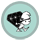

!SLIDE transition=scrollLeft
# DrugGame with Gosu #
## Krzysztof Kotlarek ##
### Twitter: @krzkot ###
### Github:  lis2 ###
### Email:   kotlarek.krzysztof@gmail.com ###

!SLIDE transition=scrollLeft
# Rules

!SLIDE transition=scrollLeft
# Rules

*   - 5 points
*           - 7 points
*          - 10 points
*       - 15 points
*           - 1000 points

!SLIDE transition=scrollLeft
# Gosu
http://www.libgosu.org/

!SLIDE transition=scrollLeft
# Gosu::Window
      @@@ruby
          require 'gosu'

          class GameWindow < Gosu::Window
            def initialize
            end

            def update
            end

            def draw
            end
          end

!SLIDE transition=scrollLeft

!SLIDE transition=scrollLeft
# Initialize
    @@@ruby
    class GameWindow < Gosu::Window
      def initialize
        super 640, 480, false
        self.caption = "DrugGame"
        @background_image =
          Gosu::Image.new(self, "media/Bg.png")
      end
    end

!SLIDE transition=scrollLeft
# Draw
    @@@ruby
      class GameWindow < Gosu::Window
        def draw
          @background_image.draw(0, 0, 0)
        end
      end

!SLIDE transition=scrollLeft
# Player
    @@@ruby
      class Player
        def initialize(window)
          @image =
            Gosu::Image.new(window, "media/player.png")
          @x = @vel_x = @y = @vel_y = 0.0
        end

        def warp(x, y) ; @x, @y = x, y ; end

        def turn_left ; @vel_x -= 4.5 ; end

        def turn_right ; @vel_x += 4.5 ; end

        def move
          @x += @vel_x
          @vel_x *= 0.95
        end

        def draw
          @image.draw_rot(@x, @y, 1, 0)
        end
      end

!SLIDE transition=scrollLeft
#Adding player to window
    @@@ruby
      class GameWindow < Gosu::Window
        def initialize
          ...
          @player = Player.new(self)
          @player.warp(500, 500)
        end

        def draw
          ...
          @player.draw
        end
      end

!SLIDE transition=scrollLeft
#Keyboard
    @@@ruby
      class GameWindow < Gosu::Window
        def update
          if button_down? Gosu::KbLeft ||
            button_down? Gosu::GpLeft
            @player.turn_left
          end
          if button_down? Gosu::KbRight ||
            button_down? Gosu::GpRight
            @player.turn_right
          end
          @player.move
        end
      end

!SLIDE transition=scrollLeft
#Gravity
    @@@ruby
      class Player
        def set_gravity
          @vy += 1
          if @vy > 0
            @vy.times do
              if would_fit(0, 1)
                @y += 1
              else
                @vy = 0
              end
            end
          end
          (-@vy).times { @y -= 1 } if @vy < 0
        end
      end

!SLIDE transition=scrollLeft
#Jump
    @@@ruby
      class Player
        def jump
          @vy = -20 if @map.solid?(@x, @y, @height)
        end
      end

      class GameWindow < Gosu::Window
        def update
        ...
          if button_down?(Gosu::KbUp) ||
            button_down?(Gosu::GpButton0)
            @player.jump
          end
        end
      end

!SLIDE transition=scrollLeft
#Distance
      @@@ruby
        def collect_awards(awards)
          awards.reject! do |award|
          if Gosu::distance(@x, @y, award.x, award.y) < 50
            @score += award.score
          else
            false
          end
        end

!SLIDE transition=scrollLeft
#Camera
      @@@ruby
        def draw
          translate(-@camera_x, -@camera_y) do
            @player.draw
            @background_image.draw(0, -500, 0)
            @map.draw

            @awards.each { |award| award.draw }
            @monsters.each { |monster| monster.draw }
          end
          @font.draw("Score: #{@player.score}", 
            10, 10, 2, 1.0, 1.0, 0xffffff00)
        end

!SLIDE transition=scrollLeft
#Load tiles
      @@@ruby
        @standing, @walk_right1, @walk_right2,
          @walk_left1, @walk_left2 =
          Gosu::Image.load_tiles(@window, "media/dwarf.png",
          56, 80, false)
  

!SLIDE transition=scrollLeft
#Q & A
