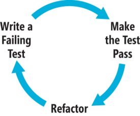

!SLIDE transition=scrollLeft home
# DrugGame with Gosu #
# Rspec #
## Krzysztof Kotlarek ##
### Twitter: @krzkot ###
### Github:  lis2 ###
### Email:   kotlarek.krzysztof@gmail.com ###

!SLIDE transition=scrollLeft
# How?

!SLIDE transition=scrollLeft
# Rspec with DrugGame

!SLIDE transition=scrollLeft
# Rules

!SLIDE transition=scrollLeft
# Rules

*   - 5 points
*           - 7 points
*          - 10 points
*       - 15 points
*           - 1000 points

!SLIDE transition=scrollLeft
# Gosu
http://www.libgosu.org/

!SLIDE transition=scrollLeft
# Gosu::Window
      @@@ruby
      
          require 'gosu'

          class GameWindow < Gosu::Window
            def initialize
            end

            def update
            end

            def draw
            end
          end

!SLIDE transition=scrollLeft

!SLIDE transition=scrollLeft
# Initialize
    @@@ruby

    class GameWindow < Gosu::Window
      def initialize
        super 640, 480, false
        self.caption = "DrugGame"
        @background_image =
          Gosu::Image.new(self, "media/Bg.png")
      end
    end

!SLIDE transition=scrollLeft
# Draw
    @@@ruby

      class GameWindow < Gosu::Window
        def draw
          @background_image.draw(0, 0, 0)
        end
      end

!SLIDE transition=scrollLeft
# Player
    @@@ruby

      class Player
        def initialize(window)
          @image =
            Gosu::Image.new(window, "media/player.png")
          @x = @vel_x = @y = @vel_y = 0.0
        end

        def warp(x, y) ; @x, @y = x, y ; end

        def turn_left ; @vel_x -= 4.5 ; end

        def turn_right ; @vel_x += 4.5 ; end

        def move
          @x += @vel_x
          @vel_x *= 0.95
        end

        def draw
          @image.draw_rot(@x, @y, 1, 0)
        end
      end

!SLIDE transition=scrollLeft
#Adding player to window
    @@@ruby

      class GameWindow < Gosu::Window
        def initialize
          ...
          @player = Player.new(self)
          @player.warp(500, 500)
        end

        def draw
          ...
          @player.draw
        end
      end

!SLIDE transition=scrollLeft
#Keyboard
    @@@ruby

      class GameWindow < Gosu::Window
        def update
          if button_down? Gosu::KbLeft ||
            button_down? Gosu::GpLeft
            @player.turn_left
          end
          if button_down? Gosu::KbRight ||
            button_down? Gosu::GpRight
            @player.turn_right
          end
          @player.move
        end
      end

!SLIDE transition=scrollLeft
#Gravity
    @@@ruby

      class Player
        def set_gravity
          @vy += 1
          if @vy > 0
            @vy.times do
              if would_fit(0, 1)
                @y += 1
              else
                @vy = 0
              end
            end
          end
          (-@vy).times { @y -= 1 } if @vy < 0
        end
      end

!SLIDE transition=scrollLeft
#Jump
    @@@ruby

      class Player
        def jump
          @vy = -20 if @map.solid?(@x, @y, @height)
        end
      end

      class GameWindow < Gosu::Window
        def update
        ...
          if button_down?(Gosu::KbUp) ||
            button_down?(Gosu::GpButton0)
            @player.jump
          end
        end
      end

!SLIDE transition=scrollLeft
#Distance
      @@@ruby

        def collect_awards(awards)
          awards.reject! do |award|
          if Gosu::distance(@x, @y, award.x, award.y) < 50
            @score += award.score
          else
            false
          end
        end

!SLIDE transition=scrollLeft
#Camera
      @@@ruby

        def draw
          translate(-@camera_x, -@camera_y) do
            @player.draw
            @background_image.draw(0, -500, 0)
            @map.draw

            @awards.each { |award| award.draw }
            @monsters.each { |monster| monster.draw }
          end
          @font.draw("Score: #{@player.score}", 
            10, 10, 2, 1.0, 1.0, 0xffffff00)
        end

!SLIDE transition=scrollLeft
#Why?

* check your code
* help avoid crappy code

!SLIDE transition=scrollLeft
#Rspec or TestUnit?

!SLIDE transition=scrollLeft
#Describe and context
    @@@ruby

      describe DrugGame::GameWindow do

        context "monsters" do
        end

        context "awards" do
          context "score" do
          end
        end
      end

!SLIDE transition=scrollLeft
#Example
    @@@ruby

      describe User do

        it "should have correct first name" do
          user = User.create(first_name: "John", last_name: "Rambo")
          user.first_name.should == "John"
        end

        it "should have correct last name" do
          user = User.create(first_name: "John", last_name: "Rambo")
          user.last_name.should == "Rambo"
        end

!SLIDE transition=scrollLeft
#Matchers
    @@@ruby

      user.name.should eq("John")
      user.name.should == "John"
      user.age.should >= 18
      user.name.should match(/ohn/)
      user.adult.should be_true
      user.friends.should be_empty # empty?

!SLIDE transition=scrollLeft
#Matchers
    @@@ruby
      
      def awesome?
        true
      end

      user.should be_awesome

!SLIDE transition=scrollLeft
#Lambda
    @@@ruby

    lambda do
        post :create, :user => { name: "John" }
    end.should change(User, :count).by(1)

!SLIDE transition=scrollLeft
#Example
    @@@ruby

      describe User do

        it "should have correct first name" do
          user = User.create(first_name: "John", last_name: "Rambo")
          user.first_name.should == "John"
        end

        it "should have correct last name" do
          user = User.create(first_name: "John", last_name: "Rambo")
          user.last_name.should == "Rambo"
        end

!SLIDE transition=scrollLeft
#Let or Let!

    @@@ruby

      describe User do
        let(:user) { User.create(first_name: "John", last_name: "Rambo") }
        let!(current_user) { ... }

        it "should have correct first name" do
          user.first_name.should == "John"
        end

        it "should have correct last name" do
          user.last_name.should == "Rambo"
        end
      end
!SLIDE transition=scrollLeft
#New syntax
    @@@ruby

      foo.should eq(bar)
      foo.should_not eq(bar)

      expect(foo).to eq(bar)
      expect(foo).not_to eq(bar)

!SLIDE transition=scrollLeft
#New syntax
    @@@ruby

    lambda do
        post :create, :user => { name: "John" }
    end.should change(User, :count).by(1)

    expect do 
        post :create, :user => { name: "John" }
    end.to change(User, :count).by(1)

!SLIDE transition=scrollLeft
#stub
    @@@ruby

      Class Claim
        def send_to_ess
          SEND_TO_ESS!!!
        end

        def valid?
          send_to_ess
          return true
        end
      end

      claim.should be_valid

!SLIDE transition=scrollLeft
#stub
    @@@ruby
      Class Claim
        def send_to_ess
          SEND_TO_ESS!!!
        end

        def valid?
          send_to_ess
          return true
        end
      end

      claim.stub(:send_to_ess).and_return(true)
      claim.should be_valid

!SLIDE transition=scrollLeft
#mock
    @@@ruby
  
      Class User
        def find_friend
          find if age == 18
        end
      end

      user = double("User, age: 18, gender: male")
      user.should_receive(:find) { user }
      user.find_friend

!SLIDE transition=scrollLeft
#How?

!SLIDE transition=scrollLeft
#remove e-mail field

!SLIDE transition=scrollLeft
    @@@ruby

      it "should be valid when email empty" do
        @user = Category.create(name: "Chris", email: "bla@mailinator.com")
        @user.email = ""
        @user.save
        @user.email.should == ""
      end

!SLIDE transition=scrollLeft
    @@@ruby
      validates_presence_of :email

!SLIDE transition=scrollLeft
    @@@ruby

      it "should be valid when email empty" do
        @user = Category.create(name: "Chris", email: "bla@mailinator.com)
        @user.email = ""
        @user.save
        @user.email.should == ""
      end

!SLIDE transition=scrollLeft
    @@@ruby

      it "should be valid when email empty" do
        @user = Category.create(name: "Chris", email: "bla@mailinator.com)
        @user.email = ""
        @user.save
        @user.reload
        @user.email.should == ""
      end

!SLIDE transition=scrollLeft
#Lets test our game

!SLIDE transition=scrollLeft
#movable.rb
    @@@ruby

      def warp(x, y)
        @x, @y = x, y
      end

!SLIDE transition=scrollLeft
#movable_spec.rb
    @@@ruby

      let(:movable) { DrugGame::Movable.new($window) }

      it "should set position" do
        movable.warp(40, 50)
        movable.x.should == 40
        movable.y.should == 50
      end

!SLIDE transition=scrollLeft
#movable.rb
    @@@ruby

      def turn_left
        @vel_x = -5
      end

!SLIDE transition=scrollLeft
#movable_spec.rb
    @@@ruby

      let(:movable) { DrugGame::Movable.new($window) }
      it "should turn left" do
        lambda {
          movable.turn_left
        }.should change(movable, :vel_x).by(-5)
      end

!SLIDE transition=scrollLeft
#movable.rb
    @@@ruby

      def turn_right
        @vel_x = +5
      end

!SLIDE transition=scrollLeft
#movable_spec.rb
    @@@ruby

      let(:movable) { DrugGame::Movable.new($window) }

      it "should turn right" do
        lambda {
          movable.turn_right
        }.should change(movable, :vel_x).by(5)
      end

!SLIDE transition=scrollLeft
#game_window.rb
    @@@ruby

     def update
      @monsters.push(DrugGame::Monster.new(self)) if rand(1000) < 5 && @monsters.size < 25
      @monsters.each { |monster| monster.move }
      @awards.push(DrugGame::Award.new(self)) if rand(100) < 4 && @awards.size < 25
      @awards.each { |award| award.move }
      @player.move
      @player.collect_awards(@awards)
      @player.touch_monster(@monsters)
      @camera_x = [[@player.x - self.width/2, 0].max, @map.width - self.width].min
      @camera_y = -[[@height/2 - @player.y, 0].max, height/2].min
    end

!SLIDE transition=scrollLeft
#game_window.rb
    @@@ruby

      def update
        generate_monsters
        generate_awards
        set_player
        set_camera
      end

      def generate_monsters
        @monsters.push(DrugGame::Monster.new(self)) if rand(1000) < 5 && @monsters.size < 25
        @monsters.each { |monster| monster.move }
      end
!SLIDE transition=scrollLeft
#game_window.rb

    @@@ruby
      context "monsters" do
        it "should not generate monster" do
          lambda {
            $window.stub(:rand).and_return(5)
            $window.generate_monsters
          }.should_not change($window.monsters, :length)
        end
     
        it "should generate monster" do
          lambda {
            $window.stub(:rand).and_return(3)
            $window.generate_monsters
          }.should change($window.monsters, :length).by(1)
        end
      end

!SLIDE transition=scrollLeft
#validation

    @@@ruby 
      it "should have valid name" do
        @user = User.create(name: "John")
        @user.name == ""
        @user.should_not be_valid
      end
!SLIDE transition=scrollLeft
#Shoulda
    @@@ruby

      it { should belong_to(:user) }
      it { should have_many(:tags).through(:taggings) }
      it { should validate_uniqueness_of(:title) }
      it { should validate_uniqueness_of(:title).scoped_to(:user_id) }
      it { should validate_presence_of(:body).with_message(/wtf/) }
      it { should validate_presence_of(:title) }
      it { should validate_numericality_of(:user_id) }
      it { should delegate_method(:work).to(:robot) }

!SLIDE transition=scrollLeft
#Q & A
