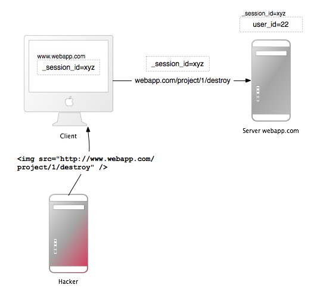
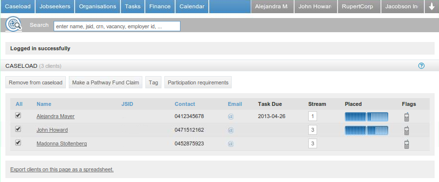
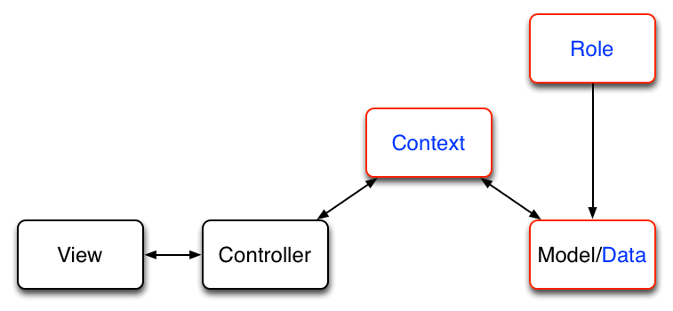

!SLIDE full-page home light-on-dark
# Security in Rails #
### Twitter: @krzkot ###
### Github:  lis2 ###
### Email:   kotlarek.krzysztof@gmail.com ###
[background](/image/images/ruby.jpg)

!SLIDE full-page center

!SLIDE
# Cookies
- max size of 4KB

!SLIDE center
# Session id in Rails
- current_time
- random 0 or 1
- process of number of Ruby interpreter
- string from config file

!SLIDE full-page center
# Cross-site request forgery

!SLIDE full-page 
# World Wide Web Consortium (W3C) recommendations
- use GET to get data
- use POST, PUT, DELETE to modify data

!SLIDE full-page center
    @@@ html
    <a href="http://www.harmless.com/" onclick="
      var f = document.createElement('form');
      f.style.display = 'none';
      this.parentNode.appendChild(f);
      f.method = 'POST';
      f.action = 'http://www.example.com/account/destroy';
      f.submit();
    return false;">To the harmless survey</a>

!SLIDE 
# Security token
    @@@ html
    <input name="authenticity_token" type="hidden" value="fdgfe342f3ddblablablfr43de">

!SLIDE 
# Security token
* current session
* secret string

!SLIDE 
    @@@ ruby
    protect_from_forgery secret: "123456789012345678901234567890..."

!SLIDE
# SQL injection
    @@@ ruby
    Project.where("name = '#{params[:name]}'")
    # OR 1 -- 
    SELECT * FROM projects WHERE name = '' OR 1 --'

!SLIDE
# SQL injection
    @@@ ruby
    Project.where("name = ?", params[:name])
    
!SLIDE
# XSS
    @@@ html
    
!SLIDE 
# XSS 
    @@@ html
    

!SLIDE
# Rails 2
    @@@ ruby
    <%= h post.comments.first %>

!SLIDE
# Rails 3
    @@@ ruby
    <%= post.comments.first %>

!SLIDE 
# html_safe

!SLIDE 
# CSS Injection
    @@@ html
    

!SLIDE full-page home light-on-dark
# Obesity in Rails #
### Twitter: @krzkot ###
### Github:  lis2 ###
### Email:   kotlarek.krzysztof@gmail.com ###
[background](/image/images/ruby.jpg)

!SLIDE full-page light-on-dark
[background](/image/images/howto.jpg)

!SLIDE full-page light-on-dark
# Fat model skinny controller
[background](/image/images/book.jpg)
   
!SLIDE full-page center

!SLIDE full-page center

!SLIDE
# client.rb
* ~ 1084 lines 
* ~ 2370 lines (with modules)
!SLIDE
# Methods
* update\_latest_epp
* epp\_update_needed?
* add\_to_caseload
* remove\_from_caseload

!SLIDE
# Methods
* appointment\_options
* has\_an\_appointment_for
* last\_contact
* next\_contact

!SLIDE
# Methods
* contact\_overdue?
* contact\_due
* latest\_contact

!SLIDE full-page center

!SLIDE full-page light-on-dark
# DCI
[background](/image/images/java.png)

!SLIDE
# Who?
* 2009
* Trygve Reenskaug

!SLIDE
# Why?
* Separate behaviour from data model
* Make behaviour first-class citizen
* Cleanly separate code for rapidly changing system behavior 

!SLIDE
# Data
* Pure information what system is
* Objects which contain metchods to change their state
* No interacion between other objects

!SLIDE 
# Context 
* Inject roles 

!SLIDE
# Interaction
* Interaction is "what the system does."
* The interaction is implemented as Roles which are played by objects at run time

!SLIDE center

!SLIDE center
# Example

    @@@ ruby
    class EppsController 
      def create
        @client.as(Roles::EPP)
        @client.update_latest_epp if @client.epp_updated_needed
      end
    end

    class ClientsController
      def show
        @client.update_latest_epp # raise error method not found
      end
    end

!SLIDE full-page light-on-dark
# How?!
[background](/image/images/howto.jpg)

!SLIDE 
    @@@ ruby
    class Client
      attr_accessor :epp
    end

!SLIDE full-page light-on-dark
# Extend
[background](/image/images/howto.jpg)

!SLIDE
    @@@ ruby
    module Roles
      module EPP
        def update_latest_epp
          self.epp = "Latest EPP"
        end
      end
    end
    
    class Object
      def as(role)
        self.extend(role)
      end
    end
    
    @client = Client.new
    @client.as(Roles::EPP).update_latest_epp
    puts @client.epp # Latest EPP

!SLIDE full-page light-on-dark
# Downsides
* No unextend
* Can be slow in some rubies
[background](/image/images/bad.jpg)

!SLIDE full-page light-on-dark

[background](/image/images/howto.jpg)

!SLIDE
    @@@ ruby

    module Roles
      class EPP < Struct.new(:object)
        def update_latest_epp
          object.epp = "Latest EPP"
        end
      end
    end
    
    class Object
      def as(role)
        role.new(self)
      end
    end
    
    @client = Client.new
    @client.as(Roles::EPP).update_latest_epp
    puts @client.epp # Latest EPP

!SLIDE full-page light-on-dark
# Downsides
* Role is a class instead of module
[background](/image/images/bad.jpg)

!SLIDE full-page light-on-dark
# Delegation
[background](/image/images/howto.jpg)

!SLIDE
# SimpleDelegator
* A concrete implementation of Delegator, this class provides the means to delegate all supported method calls to the object passed into the constructor 

!SLIDE 
    @@@ ruby

    require "delegate"
    module Roles
      class EPP < SimpleDelegator
        def update_latest_epp
          self.epp = "Latest EPP"
        end
      end
    end
    
    class Object
      def as(role)
        role.new(self)
      end
    end
    
    @client = Client.new
    @client.as(Roles::EPP).update_latest_epp
    puts @client.epp # Latest EPP

!SLIDE full-page light-on-dark
# Downsides
* Use method_missing
* Role is a class instead of module
[background](/image/images/bad.jpg)

!SLIDE full-page light-on-dark
# Delegate class
[background](/image/images/howto.jpg)

!SLIDE 
    @@@ ruby

    require "delegate"
    module Roles
      class EPP < DelegateClass(Client)
        def update_latest_epp
          self.epp = "Latest EPP"
        end
      end
    end
    
    class Object
      def as(role)
        role.new(self)
      end
    end
    
    @client = Client.new
    @client.as(Roles::EPP).update_latest_epp
    puts @client.epp # Latest EPP

!SLIDE full-page light-on-dark
# Downsides
* Static delegation relationship
* Role is a class instead of module

[background](/image/images/bad.jpg)

!SLIDE full-page light-on-dark center
# Books

[background](/image/images/book.jpg)

!SLIDE center
# Problem?

!SLIDE full-page light-on-dark
# How to lose weight?
[background](/image/images/fitness.jpg)

!SLIDE full-page light-on-dark
# Don’t Extract Mixins from Fat Models

!SLIDE full-page light-on-dark
# Validations
[background](/image/images/howto.jpg)

!SLIDE center
# Reform

!SLIDE center
    @@@ ruby
    class SongForm < Reform::Form
      property :title
      property :length

      validates :title,  presence: true
      validates :length, numericality: true
    end

!SLIDE center
    @@@ ruby
    class SongsController
      def new
        @form = SongForm.new(Song.new)
      end

      def edit
        @form = SongForm.new(Song.find(1))
      end
    end

!SLIDE center
    @@@ ruby
    = form_for @form do |f|
      = f.input :name
      = f.input :title

!SLIDE center
    @@@ ruby
    class SongsController
      def create
        @form = SongForm.new(Song.new)
        #=> params: {song: {title: "Rio", length: "366"}}
        if @form.validate(params[:song])
          @form.save
        end
      end
    end

!SLIDE 
# You should access your data using forms even not user facing actions should use forms.

!SLIDE
    @@@ ruby
    class Employer << ActiveRecord::Base
      validate_presence_of :abn, if: !@importer
    end

!SLIDE
# 2014
    @@@ ruby
    class Employer << ActiveRecord::Base
      validate_presence_of :abn, if: (!@importer && !@importerB)
    end

!SLIDE full-page light-on-dark
# Extract Value Objects
[background](/image/images/howto.jpg)

!SLIDE
# Value Objects are simple objects whose equality is dependent on their value rather than an identity
* Date

!SLIDE    
    @@@ ruby
    class MoneyValues
      def initialize(object)
        @object = object
      end

      def self.from_placement(placement)
        new(placement)
      end

      def values
        some logic
      end

      def format_to_currency
      end
    end

!SLIDE    
    @@@ ruby
    class OutcomeJob < Job
      data[:value] = ClaimValues.from_placement(placement).value
    end
 
!SLIDE full-page light-on-dark
# Extract Service Objects
[background](/image/images/howto.jpg)

!SLIDE center
# Some actions in a system warrant a Service Object to encapsulate their operation

* The action is complex (e.g. closing the books at the end of an accounting period)
* The action reaches across multiple models (e.g. an e-commerce purchase using Order, CreditCard and Customer objects)
* The action interacts with an external service (e.g. posting to social networks)

!SLIDE
    @@@ ruby
    class UserAuthenticator
      def initialize(user)
        @user = user
      end

      def authenticate(unencrypted_password)
        return false unless @user

        if BCrypt::Password.new(@user.password_digest) == unencrypted_password
          @user
        else
          false
        end
      end
    end

!SLIDE
    @@@ ruby
    class SessionsController < ApplicationController
      def create
        user = User.where(email: params[:email]).first

        if UserAuthenticator.new(user).authenticate(params[:password])
          self.current_user = user
          redirect_to dashboard_path
        else
          flash[:alert] = "Login failed."
          render "new"
        end
      end
    end

!SLIDE full-page light-on-dark
# It is easier to control weight than lose
[background](/image/images/fitness2.jpg)

!SLIDE full-page home light-on-dark
# Thank you
[background](/image/images/ruby.jpg)
