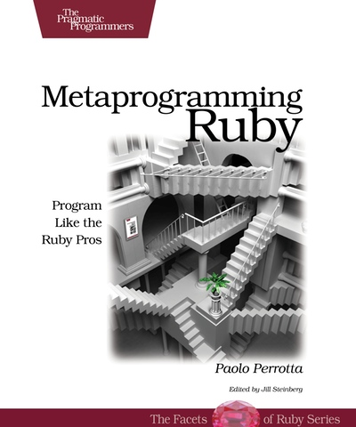

!SLIDE full-page home light-on-dark
# Objects in Ruby - extended#
### Twitter: @krzkot ###
### Github:  lis2 ###
### Email:   kotlarek.krzysztof@gmail.com ###

!SLIDE full-page 
* classes are open
* class is an object
* self
* defining methods 
* Eigenclasses
!SLIDE full-page mem

!SLIDE full-page light-on-dark
# Blocks

!SLIDE full-page
# Example
        @@@ ruby 
    def test(x)
      x += 5
      yield(x)
    end
    
    puts test(5) {|x| x * x } # => 100

!SLIDE full-page
# Example
        @@@ ruby 
    def a_method(a, b) 
      a + yield(a, b)
    end

    a_method(1,2) {|x,y| (x+y) * 3} #=>10

!SLIDE full-page
# block_given?
        @@@ ruby 
    def a_method
      return yield if block_given?
      'no block'
    end

    a_method # => "no block"
    a_method { "here's a block!" } # => "here's a block!"

!SLIDE full-page light-on-dark
# In the Wild

!SLIDE full-page

# API DSL
        @@@ ruby 
    use_api do
      conn.get("/forms")
      conn.get("/form-submissions")
    end

!SLIDE full-page

# API DSL
        @@@ ruby 
    def use_api 
      conn = connect_to_api
      yield
      disconect_from_api
    end

    use_api do
      conn.get("/forms")
      conn.get("/form-submissions")
    end

!SLIDE full-page
        @@@ ruby 
    def my_method
      x = "Goodbye"
      yield("cruel") 
    end

    x = "Hello"
    my_method {|y| "#{x}, #{y} world" } # => "Hello, cruel world"

!SLIDE full-page mem

!SLIDE full-page light-on-dark
# Scope

!SLIDE full-page
        @@@ ruby 
    v1 = 1
    class MyClass 
      v2 = 2
      local_variables # => [:v2]
      
      def my_method 
        v3 = 3
        local_variables # => [:v3]
      end

      local_variables # => [:v2]
    end

    obj = MyClass.new
    obj.my_method # => [:v3]
    obj.my_method # => [:v3]
    local_variables # => [:v1, :obj]

!SLIDE full-page 
# Scope gates
* Class definitions
* Module definitions 
* Methods

!SLIDE full-page
        @@@ ruby 
    v1 = 1
    class MyClass 
      v2 = 2
      local_variables # => [:v2]
      
      def my_method 
        v3 = 3
        local_variables # => [:v3]
      end

      local_variables # => [:v2]
    end

    obj = MyClass.new
    obj.my_method # => [:v3]
    obj.my_method # => [:v3]
    local_variables # => [:v1, :obj]

!SLIDE full-page
# Flattering scope
        @@@ ruby 
    my_var = "Success"

    class MyClass
      my_var # I want access!
    end
!SLIDE full-page
        @@@ ruby 
    my_var = "Success"

    MyClass = Class.new do
      # Now we can print my_var here...
      puts "#{my_var} in the class definition!"

      def my_method
        # ...but how can we print it here?
      end
    end

!SLIDE full-page
        @@@ ruby 
    my_var = "Success"

    MyClass = Class.new do
      # Now we can print my_var here...
      puts "#{my_var} in the class definition!"

      define :my_method do
        puts "#{my_var} in the method!"
      end
    end
    
    MyClass.new.my_method
    Success in the class definition! 
    Success in the method!

!SLIDE full-page
        @@@ ruby 
    def define_methods
      shared = 0
     
      Kernel.send :define_method, :counter do 
        shared
      end

      Kernel.send :define_method, :inc do |x| 
        shared += x
      end
    end

    define_methods
    counter       # => 0
    inc(4)
    counter       # => 4

!SLIDE full-page
# Why not @@ ?!

!SLIDE full-page
        @@@ ruby
    class MyClass
      @@v = "I am great"
      def self.show
        puts @@v
      end
    end
    
    class MyClass2 < MyClass
      @@v = "I am awasome"
    end
    
    puts MyClass.show

!SLIDE full-page
        @@@ ruby
    class MyClass
      @@v = "I am great"
      def self.show
        puts @@v
      end
    end
    
    class MyClass2 < MyClass
      @@v = "I am awasome"
    end
    
    puts MyClass.show # => I am awesome

!SLIDE full-page
        @@@ ruby 
    @@v = 1
    class MyClass
      @@v = 2
    end
    puts @@v #=>2

!SLIDE full-page
        @@@ ruby 
    def my_method
      x = "Goodbye"
      yield("cruel") 
    end

    x = "Hello"
    my_method {|y| "#{x}, #{y} world" } # => "Hello, cruel world"

!SLIDE full-page home light-on-dark
# Callable objects

!SLIDE full-page
        @@@ ruby 
    nc = Proc.new {|x| x + 1 }
    # more code...
    inc.call(2) # => 3

    dec = lambda {|x| x - 1 } 
    # more code...
    dec.call(2) # => 1

!SLIDE full-page
        @@@ ruby 
    p = Proc.new {|a, b| [a, b]}
    p.call(1, 2, 3)   # => [1, 2]
    p.call(1)         # => [1, nil]

!SLIDE full-page
        @@@ ruby 
    def math(a, b) 
      yield(a, b)
    end
    
    def teach_math(a, b, &operation) 
      puts operation.call(a, b)
      puts "Let's do the math:"
      puts math(a, b, &operation)
    end

    teach_math(2, 3) {|x, y| x * y}
    # => 6
    # => Let's do the math: 6

!SLIDE full-page light-on-dark
# In the Wild

!SLIDE full-page 

# HighLine

        @@@ ruby
    name = hl.ask("Name?", lambda {|s| s.capitalize }) 
    puts "Hello, #{name}"
    ⇒ Name?
    ⇐ bill
    ⇒ Hello, Bill!

    zip = ask("Zip?  ") { |q| q.validate = /\A\d{5}(?:-?\d{4})?\Z/ }

!SLIDE full-page 

# HighLine
        @@@ ruby
    def ask( question, answer_type = String, &details )

!SLIDE full-page light-on-dark
# Epic final

!SLIDE full-page 
        @@@ ruby
    class Person
      include CheckedAttributes
      attr_checked :age { |v| v >= 18 }
    end

    me = Person.new
    me.age = 39
    me.age = 12
    # OK
    # Exception!

!SLIDE full-page 
# eval
        @@@ ruby
    array = [10, 20]
    element = 30
    eval("array << element") # => [10, 20, 30]

!SLIDE full-page 
# kernel method
        @@@ ruby
    def add_checked_attribute(clazz, attribute) 
      eval "
        class #{clazz}
        def #{attribute}=(value)
          raise 'Invalid attribute' unless value
          @#{attribute} = value 
        end
        def #{attribute}() 
          @#{attribute}
        end
      end
    "
    end

!SLIDE full-page 
        @@@ ruby
    add_checked_attribute(Person, :age)

    class Person
      def my_attr=(value)
        raise 'Invalid attribute' unless value
        @my_attr = value
      end
      def my_attr() 
        @my_attr
      end 
    end
    
!SLIDE full-page 
# kernel method
        @@@ ruby
    def add_checked_attribute(clazz, attribute) 
      eval "
        class #{clazz}
        def #{attribute}=(value)
          raise 'Invalid attribute' unless value
          @#{attribute} = value 
        end
        def #{attribute}() 
          @#{attribute}
        end
      end
    "
    end

!SLIDE full-page 
        @@@ ruby
    def add_checked_attribute(clazz, attribute) 
      clazz.class_eval do
        define_method "#{attribute}=" do |value|
          raise 'Invalid attribute' unless value 
          instance_variable_set("@#{attribute}", value)
        end
        define_method attribute do 
          instance_variable_get "@#{attribute}"
        end 
      end
    end

!SLIDE full-page 
        @@@ ruby
    def add_checked_attribute(clazz, attribute, &validation) 
      clazz.class_eval do
        define_method "#{attribute}=" do |value|
          raise 'Invalid attribute' unless validation.call(value)
          instance_variable_set("@#{attribute}", value)
        end
        define_method attribute do 
          instance_variable_get "@#{attribute}"
        end 
      end
    end

!SLIDE full-page 
        @@@ ruby
    add_checked_attribute(Person, :age, { |v| v >= 18 })

    class Person
      include CheckedAttributes
      attr_checked :age { |v| v >= 18 }
    end

!SLIDE full-page 
        @@@ ruby
    class Class
      def attr_checked(attribute, &validation)
        def add_checked_attribute(clazz, attribute, &validation) 
          clazz.class_eval do
            define_method "#{attribute}=" do |value|
              raise 'Invalid attribute' unless validation.call(value)
              instance_variable_set("@#{attribute}", value)
            end
            define_method attribute do 
              instance_variable_get "@#{attribute}"
            end 
          end
        end
      end
    end

!SLIDE full-page 
        @@@ ruby
    class Person
      include CheckedAttributes
      attr_checked :age { |v| v >= 18 }
    end

!SLIDE full-page 
# included
        @@@ ruby
    module M
      def self.included(othermod)
        puts "M was mixed into #{othermod}"
      end
    end
    
    class C 
      include M # => M was mixed into C
    end

!SLIDE full-page 
        @@@ ruby
    module CheckedAttributes
      def self.included(base)
        base.extend ClassMethods
      end
      module ClassMethods
        def attr_checked(attribute, &validation)
          def add_checked_attribute(clazz, attribute, &validation) 
            clazz.class_eval do
              define_method "#{attribute}=" do |value|
                raise 'Invalid attribute' unless validation.call(value)
                instance_variable_set("@#{attribute}", value)
              end
              define_method attribute do 
                instance_variable_get "@#{attribute}"
              end 
            end
          end
        end
      end
    end

!SLIDE full-page 
        @@@ ruby
    class Person
      include CheckedAttributes
      attr_checked :age { |v| v >= 18 }
    end

!SLIDE full-page light-on-dark
# Hungry ?

!SLIDE full-page light-on-dark
# Resources

!SLIDE full-page mem

!SLIDE full-page mem

