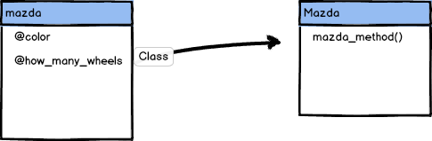
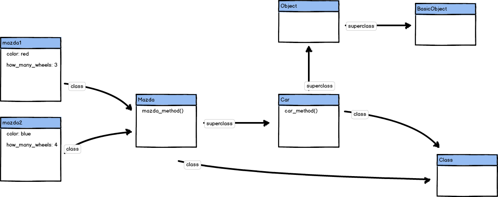
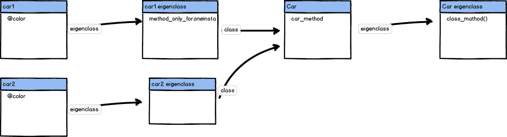
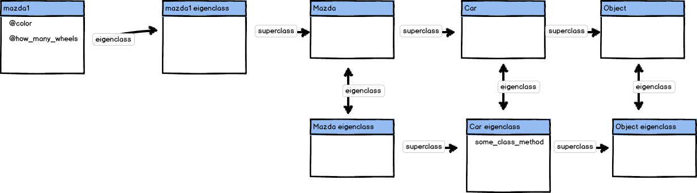
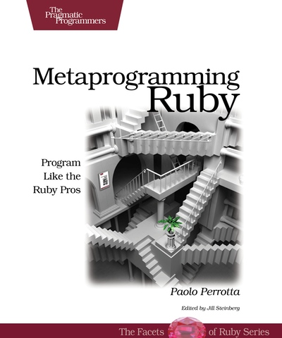

!SLIDE full-page home light-on-dark
# Objects in Ruby #
### Twitter: @krzkot ###
### Github:  lis2 ###
### Email:   kotlarek.krzysztof@gmail.com ###

!SLIDE full-page
# Example
        @@@ ruby 
    class Car
      attr_accessor :color

      def initialize(color)
        @color = color
      end
      
      def car_method
      end
    end

    class Mazda < Car
      attr_accessor :how_many_wheels

      def initialize(color, how_many_wheels)
        @how_many_wheels = how_many_wheels
        super(color)
      end

      def mazda_method
      end
    end

!SLIDE full-page light-on-dark
# Classes are open

!SLIDE full-page
        @@@ ruby
    s = "Very cool string"
    puts s.say_hello # => Welcome! 

!SLIDE full-page
        @@@ ruby
    class String
      def say_hello
        "Welcome!"
      end
    end

    s = "Very cool string"
    puts s.say_hello # => Welcome! 

!SLIDE full-page
        @@@ ruby class Car
    mazda = Mazda.new("red", 4)
    
    puts mazda.instance_variables # => @color, @how_many_wheels
    puts mazda.class.instance_methods(false) # => mazda_method

!SLIDE full-page

!SLIDE full-page light-on-dark
# Everything is an object

!SLIDE full-page mem

!SLIDE full-page
# Example
        @@@ ruby 
    class Car
      attr_accessor :color

      def initialize(color)
        @color = color
      end
      
      def car_method
      end
    end

!SLIDE full-page
        @@@ ruby 
    Car = Class.new do
      attr_accessor :color

      def initialize(color)
        @color = color
      end
      
      def car_method
      end
    end

!SLIDE full-page
        @@@ ruby
    mazda = Mazda.new("red", 4)
    puts mazda.class # => Mazda   

!SLIDE full-page
        @@@ ruby 
    mazda = Mazda.new("red", 4)
    puts mazda.class # => Mazda   
    puts Mazda.superclass # => Car

!SLIDE full-page light-on-dark
# We need to go deeper

!SLIDE full-page
        @@@ ruby
    mazda = Mazda.new("red", 4)
    puts mazda.class # => Mazda   
    puts Mazda.superclass # => Car
    puts Car.superclass # => Object
   
!SLIDE full-page
        @@@ ruby
    mazda = Mazda.new("red", 4)
    puts mazda.class # => Mazda   
    puts Mazda.superclass # => Car
    puts Car.superclass # => Object
    puts Object.superclass # => BasicObject
   

!SLIDE full-page
        @@@ ruby
    mazda = Mazda.new("red", 4)
    puts mazda.class # => Mazda   
    puts Mazda.superclass # => Car
    puts Car.superclass # => Object
    puts Object.superclass # => BasicObject
    puts BasicObject.superclass # => nil
   
!SLIDE full-page mem

!SLIDE full-page light-on-dark
# Method lookup

!SLIDE full-page mem

# mazda1.mazda_method()

!SLIDE full-page mem

# mazda1.car_method()

!SLIDE full-page mem

# car1.another_method()

!SLIDE full-page 
        @@@ ruby
    puts Mazda.ancestors # => [Mazda, Car, Object, Kernel, BasicObject]

!SLIDE full-page mem

# car1.another_method()

!SLIDE full-page mem

!SLIDE full-page light-on-dark
# Object mixes in the Kernel module, making the built-in kernel functions globally accessible. 

!SLIDE full-page
        @@@ ruby
    puts Mazda.ancestors # => [Mazda, Car, Object, Kernel, BasicObject]

!SLIDE full-page light-on-dark
# In the Wild

!SLIDE full-page 
        @@@ ruby
    require 'rubygems'
    gem 'rails'

!SLIDE full-page 
# lib/rubygems/core\_ext/kernel\_gem.rb
        @@@ ruby
    module Kernel
      def gem(gem_name, *requirements) 
        ...
      end
    end

!SLIDE full-page 
        @@@ ruby
    require "rubygems"
    class Gyminator
      def load_rails
        gem "rails"
      end
    end

    g = Gyminator.new
    g.load_rails

!SLIDE full-page home light-on-dark
# All method calls have a receiver

!SLIDE full-page home light-on-dark
        @@@ ruby
    mazda.mazda_method()

!SLIDE full-page home light-on-dark
        @@@ ruby
    puts "Test"

!SLIDE full-page home light-on-dark
        @@@ ruby
    puts self # => main

    # test.rb:35:in `test': wrong number of arguments (0 for 2..3) (ArgumentError) 
    # from test.rb:35:in `<main>'

!SLIDE full-page home light-on-dark
        @@@ ruby
    class Mazda < Car
      def mazda_method
        another_method
      end
    
      def another_method
        puts "Something in another method"
      end
    end

    m = Mazda.new("red", 4)
    m.mazda_method # => "Something in another method"

!SLIDE full-page home light-on-dark
        @@@ ruby
    class Mazda < Car
      def mazda_method
        puts self # => #<Mazda:0x007fe06190f0f8>
        another_method
      end
    
      def another_method
        puts "Something in another method"
      end
    end

    m = Mazda.new("red", 4)
    m.mazda_method # => "Something in another method"

!SLIDE full-page light-on-dark
# In the Wild

!SLIDE full-page home light-on-dark
# Instance Eval

!SLIDE full-page
        @@@ ruby
    class Klass
      def initialize
        @secret = 99
      end
    end
    k = Klass.new
    k.instance_eval { @secret }   #=> 99

!SLIDE full-page light-on-dark
# In order to set the context, the variable self is set to obj while the code is executing, giving the code access to obj’s instance variables.

!SLIDE full-page
        @@@ ruby
    class Klass
      def initialize
        @secret = 99
      end
    end
    k = Klass.new
    k.instance_eval { @secret }   # => 99
    k.instance_eval { puts self } # => #<Klass:0x007fa8da8113b8>

!SLIDE full-page
        @@@ ruby
    class Klass
      def initialize
        @secret = 99
      end
    end
    k = Klass.new
    k.instance_eval { @secret }   #=> 99
    k.instance_eval { puts self } # => #<Klass:0x007fa8da8113b8>
    Klass.class_eval { puts self } # => Klass

!SLIDE full-page home light-on-dark
# Defining methods

!SLIDE full-page home light-on-dark
        @@@ ruby
    Class EssApi
      attr_accessor :api
      def initialize
        authenticate
      end

      def authenticate
        ....
      end

      def get_employer(id)
        @api.get_employer(id)
      end

      def get_jobseeker(id)
        @api.get_jobseeker
      end
    end

!SLIDE full-page home light-on-dark
        @@@ ruby
    Class EssApi
      def get_epp(id)
        @api.get_epp(id)
      end

      def get_jsci(id)
        @api.get_jsci(id)
      end
    end

!SLIDE full-page home light-on-dark
        @@@ ruby
    mazda.mazda_method()

!SLIDE full-page home light-on-dark
        @@@ ruby
    mazda.mazda_method()
    mazda.send(:mazda_method)

!SLIDE full-page home light-on-dark
        @@@ ruby
    Class EssApi
      @api.available_methods # => [:get_client, :get_employer, :get_epp, :get_jsci]
      @api.available_methods.each do |method|
        define_method(method) do |id|
          @api.send method, id
        end
      end
    end

!SLIDE full-page light-on-dark
# What if we don't have available_methods?

!SLIDE full-page home light-on-dark
        @@@ ruby
    Class EssApi
      def method_missing(method, *args)
        @api.send method, args[o]
      end
    end

!SLIDE full-page light-on-dark
# Disadvantages

!SLIDE full-page home light-on-dark
        @@@ ruby
    Class EssApi
      def method_missing(method, *args)
        unless ["get_client", "get_employer", "get_epp", "get_jsci"].include? method
          super
        else
          @api.send method
        end
      end
    end

!SLIDE full-page home light-on-dark
        @@@ ruby
    Class EssApi
      def respond_to?(method)
        ["get_client", "get_employer", "get_epp"].include?(method) ? true : super
      end
    end

!SLIDE full-page light-on-dark
# In the Wild

!SLIDE full-page home light-on-dark
        @@@ ruby

    require 'ostruct'
    test = OpenStruct.new
    test.color = "red"
    test.size = 14
    
    test.color # => "red"

!SLIDE full-page home light-on-dark
        @@@ ruby
    class MyOpenStruct 
      def initialize
        @attributes = {}
      end

      def method_missing(name, *args) 
        attribute = name.to_s
        if attribute =~ /=$/
          @attributes[attribute.chop] = args[0]
        else
          @attributes[attribute]
        end 
      end
    end
    
!SLIDE full-page home light-on-dark
        @@@ ruby
    client = Client.find(86)
    puts client.name
    puts client.address

!SLIDE full-page home
# activemodel/lib/active\_model/attribute\_methods.rb
        @@@ ruby
    def method_missing(method, *args, &block)
      if respond_to_without_attributes?(method, true)
        super
      else
        match = match_attribute_method?(method.to_s)
        match ? attribute_missing(match, *args, &block) : super
      end
    end

!SLIDE full-page light-on-dark
# Singleton methods - eigenclasses

!SLIDE full-page home light-on-dark
        @@@ ruby

    car1 = Mazda.new("red", 4)
    car2 = Mazda.new("blue", 4)

    def car1.method_only_for_one_instance
      puts "super!"
    end

    car1.method_only_for_one_instance # => "super!"
    car2.method_only_for_one_instance # => undefined method 
                                      # => `method_only_for_one_instance'

!SLIDE full-page

!SLIDE full-page light-on-dark
# "An object can have its own special, hidden class. That’s called the eigen-class of the object. Methods like Object#class() keep the eigenclass carefully hidden"

!SLIDE full-page mem

!SLIDE full-page home light-on-dark
        @@@ ruby
    class << self
    end

!SLIDE full-page home light-on-dark
        @@@ ruby

    class Car
      def Car.class_method1
      end

      def self.class_method2
      end
    end

!SLIDE full-page home light-on-dark
        @@@ ruby

    class Car
      class << self
        def class_method1
        end

        def class_method2
        end
      end
    end

!SLIDE full-page home light-on-dark
        @@@ ruby
    class Car
      def some_class_method
        puts "instance method"
      end
      class << self
        def some_class_method
          puts "class method"
        end
      end
    end

    class Mazda < Car
    end

    Mazda.some_class_method # => class method

!SLIDE full-page mem

!SLIDE full-page light-on-dark
# In the Wild

!SLIDE full-page
# lib/action_dispatch/http/url.rb
        @@@ ruby
    module ActionDispatch
      module Http
        module URL
          class << self
            def extract_domain(host, tld_length = @@tld_length)
              ...
            end
    
            def extract_subdomains(host, tld_length = @@tld_length)
              ...
            end
    
            def extract_subdomain(host, tld_length = @@tld_length)
              ...
            end

!SLIDE full-page
# lib/active_record/migration.rb
        @@@ ruby
    module ActiveRecord
    
    class << self
      attr_accessor :delegate
      attr_accessor :disable_ddl_transaction
    end

    def self.check_pending!
      raise ActiveRecord::PendingMigrationError if Migrator.needs_migration?
    end

!SLIDE full-page light-on-dark
# Resources

!SLIDE full-page mem

!SLIDE full-page mem

!SLIDE full-page
MetaProgramming - Extending Ruby for Fun and Profit
http://www.infoq.com/presentations/metaprogramming-ruby

